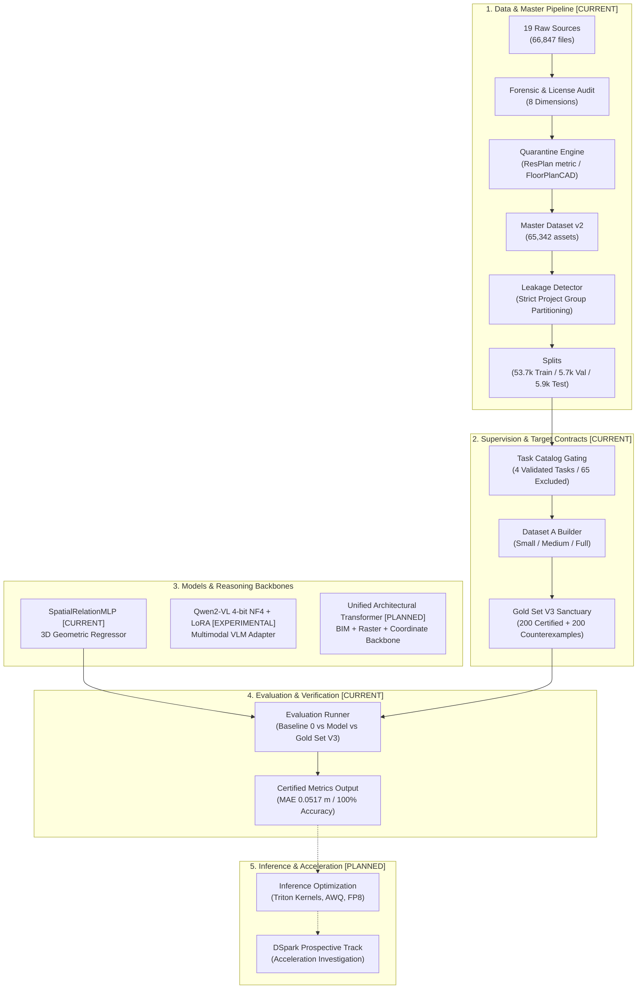

# AXIS — System & Pipeline Architecture

> **Project:** AXIS — Architectural eXpert Intelligence System  
> **Status Tagging:** `[CURRENT]` for verified implementations, `[EXPERIMENTAL]` for proof-of-concepts, `[PLANNED]` for roadmap extensions.

---

## 1. High-Level Architectural Overview

---

## 2. Component Specifications

### 2.1. Dataset Pipeline `[CURRENT]`
- **Location:** `dataset_tools/master_pipeline/`, `dataset_tools/acquisition/`, `dataset_tools/preprocessing/`
- **Function:** Ingests heterogeneous CAD, BIM, raster, and text sources. Computes streaming SHA256 hashes, extracts bounding boxes and topological partitions, applies deduplication, and groups records strictly by `project_group_id`.
- **Integrity Guarantee:** Enforces zero cross-split leakage via `SplitLeakageDetector`.

### 2.2. Supervision & Target Contracts `[CURRENT]`
- **Location:** `dataset_tools/supervision/`, `dataset_tools/experiments/`
- **Function:** Generates standardized, mathematically deterministic target contracts:
  - `FLOORPLAN_READING`: Exact room count, door count, pixel area envelopes.
  - `ROOM_TOPOLOGY`: Connected components, min/max room pixel sizes, graph adjacency.
  - `OBJECT_RELATION`: Exact Euclidean distance $d_E = \sqrt{\Delta x^2 + \Delta y^2 + \Delta z^2}$ and relative bearing in meters.
  - `CLEARANCE_CHECK`: Binary pass/fail regulatory compliance verdict against standardized clearance thresholds (Neufert / French PMR).

### 2.3. Models `[CURRENT & EXPERIMENTAL]`

#### A. Spatial Geometry Backbone: `SpatialRelationMLP` `[CURRENT]`
- **Architecture:** Multi-layer perceptron with LayerNorm, GELU activations, and coordinate feature embedding.
- **Inputs:** 3D Cartesian coordinates of source and target bounding box centroids $[x, y, z]$.
- **Outputs:** Continuous Euclidean distance (m) and binary regulatory clearance classification (`compliant: bool`).
- **Validated Checkpoint:** `ARCHI-AI-P4-005` (A-Full, seed 42, Checkpoint SHA256: `69f00c211e1db63181bf7c6f4ae624c3aa312856f7d8b2191bc9c8b84a680d54`).

#### B. Multimodal VLM Backbone: `Qwen2-VL-7B-Instruct + LoRA` `[EXPERIMENTAL]`
- **Architecture:** Vision tower frozen (`model.model.visual.requires_grad = False`), LLM backbone adapted via 4-bit NormalFloat (NF4) double quantization with PEFT LoRA ($r=8, \alpha=16$).
- **Multimodal Tokenization:** Custom `VisionLanguageDataCollator` aligning `pixel_values`, `image_grid_thw`, and M-RoPE 3D position embeddings (`mm_token_type_ids`).
- **Status:** Beyond the initial proof-of-concept dry-run, a full spatial-grounding training pilot has since completed: `RUN-022` (2,310 optimizer steps / 3 epochs on `AXIS_SPATIAL_SUPERVISION_V1`) and its evaluation `RUN-023` (63.12% topological reasoning accuracy on 1,006 held-out samples, 100% format adherence, 0% ID hallucination). However, the pre-registered Visual Dependency Index came back **VDI = 1.28** against a required **≥ 3.0** threshold (`VDI_PASS: NO`) — visual dependency has **not** been demonstrated. Not validated for production reasoning; see [`docs/PROJECT_STATUS.md`](docs/PROJECT_STATUS.md) and [`docs/SCIENTIFIC_TIMELINE.md`](docs/SCIENTIFIC_TIMELINE.md) for the full record.

---

### 2.4. Evaluation Harness `[CURRENT]`
- **Location:** `evaluation/`, `dataset_tools/experiments/`
- **Function:** Evaluates models against Baseline 0 (random, constant, heuristic) and the immutable Gold Set V3.
- **Safety Checks:** Ensures that test sets and gold sets are never loaded into training memory.

---

### 2.5. Future & Prospective Modules `[PLANNED]`
- **Direct STEP / IFC Geometry Interpreter:** Direct ingestion of IFC architectural meshes without raster approximation.
- **Unified Multimodal Architecture:** Joint attention across 2D rasters, 3D point coordinates, and normative textual rules.
- **Inference Acceleration & DSpark Evaluation:** Integration of custom Triton distance kernels and exploratory benchmarking of DSpark for low-latency spatial queries.
