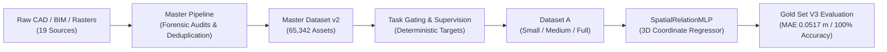

# AXIS

## Architectural eXpert Intelligence System

[](https://www.python.org/)
[](REPRODUCIBILITY.md#4-automated-test-suite-what-actually-runs-on-a-fresh-clone)
[](DATASET.md)
[](EVALUATION.md)
[-yellow.svg)](GOVERNANCE.md)

> **Official Repository:** [https://github.com/EncoreZaan/AXIS.git](https://github.com/EncoreZaan/AXIS.git)  
> **Publication Readiness:** See [`PUBLICATION_READINESS_AUDIT.md`](PUBLICATION_READINESS_AUDIT.md) for the record of what was audited, what was fixed, and what remains an open, explicitly-stated limitation.  
> **Evolution Note:** AXIS is the publicly-released research evolution of the project historically codenamed `ARCHI-AI`. "Publicly released" refers to the repository's visibility, not to its software license — see [License Status](#license-status) below, which is currently **TBD**. All scientific provenance and historical identifiers (`ARCHI-AI-P4-005`, hashes, run logs) remain preserved and fully traceable. See [`docs/history/project-history.md`](docs/history/project-history.md).

---

## Table of Contents

- [What is AXIS?](#what-is-axis)
- [Why AXIS?](#why-axis)
- [Current Status](#current-status)
- [Research Foundations & Philosophy](#research-foundations--philosophy)
- [Validated Empirical Results](#validated-empirical-results)
- [Master Dataset v2 Overview](#master-dataset-v2-overview)
- [System Architecture](#system-architecture)
- [Repository Structure](#repository-structure)
- [Reproducibility](#reproducibility)
- [Roadmap](#roadmap)
- [Contributing](#contributing)
- [Scientific Limitations & Known Blockers](#scientific-limitations--known-blockers)
- [License Status](#license-status)
- [Community & Contact](#community--contact)

---

## What is AXIS?

**AXIS (Architectural eXpert Intelligence System)** is a publicly-visible, open scientific research initiative aimed at developing specialized artificial intelligence for:

1. **Spatial Reasoning:** Understanding relative coordinate relationships, 3D Euclidean distances, clearance zones, and orientation in complex interior spaces.
2. **Geometric Reasoning:** Reading, decoding, and validating 2D architectural drawings (floorplans) and 3D Building Information Models (BIM / IFC).
3. **Architectural Understanding & Normative Compliance:** Evaluating designs against professional building standards and ergonomic regulations (e.g., Neufert standards, French accessibility/PMR thresholds).
4. **Grounded Multimodal Synthesis:** Bridging the gap between 2D floorplans, 3D spatial models, and structured textual specifications without hallucinating physical scale.

---

## Why AXIS?

General-purpose Large Language Models (LLMs) and Vision-Language Models (VLMs) demonstrate remarkable linguistic and generic perceptual abilities. However, in architectural domains, they consistently fail at fundamental physical tasks:

* **The Metric Hallucination Problem:** Models routinely invent metric surface areas ($m^2$) or wall thicknesses from uncalibrated 2D pixel rasters where no ground physical scale exists.
* **Topological Incoherence:** They fail to preserve partition graphs, confusing non-bearing partitions with structural walls or generating discontinuous circulation routes.
* **Normative & Clearance Blindness:** They cannot reliably evaluate safety and ergonomics, often failing to detect that an 85 cm passage violates wheelchair accessibility regulations.
* **Dataset Artifact Shortcuts:** Standard models exploit metadata shortcuts (memorizing typical room dimensions or file names) rather than learning true spatial geometry.

**AXIS does not attempt to clone generalist chat models.** Instead, AXIS is built from the ground up to explore specialized, mathematically grounded architectural intelligence—relying on falsifiable target contracts, multi-dimensional data audits, zero-leakage splits, and immutable benchmarks.

---

## Current Status

We adhere to strict, transparent status descriptors across the entire project:

| Subsystem / Milestone | Status | Description & Verifiable Grounding |
| :--- | :---: | :--- |
| **Master Dataset v2** | `DONE` | **65,342 unique assets** across 19 sources (`DATASET_SPLIT_REPORT.md`). 0 SHA256 leaks, 0 project leaks. |
| **Data Partitioning** | `DONE` | 53,720 train / 5,724 val / 5,898 test (= 65,342 total) + 1,563 held in a separate, isolated review queue (not summed into the 65,342). Seed = 42. See [`DATASET.md`](DATASET.md#2-dataset-partitions--anti-leakage-guarantees). |
| **Automated Test Suite** | `DONE` (maintainer environment) | **99 tests** in `tests/`; **99/99 passing requires the private RAW dataset corpus**, which is not redistributed in this repository. See [`REPRODUCIBILITY.md`](REPRODUCIBILITY.md#4-automated-test-suite-what-actually-runs-on-a-fresh-clone) for what actually runs on a fresh clone (~35/99 out of the box). |
| **Phase 4 Task Gating** | `DONE` | 4/69 tasks approved (`FLOORPLAN_READING`, `ROOM_TOPOLOGY`, `OBJECT_RELATION`, `CLEARANCE_CHECK`). 65 excluded. |
| **Gold Set V3 Sanctuary** | `DONE` | 200 certified instances + 200 hard negatives. Manifest SHA256: `81561fae5b524fa26622e5fac27d612f7d75a11e6ff0be774448fef04b9f2aca`. Immutable & read-only. **Not publicly downloadable** — see [`EVALUATION.md`](EVALUATION.md#4-artifact-availability). |
| **Clearance Benchmark** | `DONE` | **0.0517 m MAE** on Gold Set (vs Baseline 0: **2.7739 m**), a **98.14%** relative MAE reduction (arithmetic, see [`EVALUATION.md`](EVALUATION.md)). 100% Pass/Fail accuracy on a 99-positive/1-negative set of 100 — see caveat in [`EVALUATION.md`](EVALUATION.md#32-why-100-accuracy-is-not-a-robustness-proof). |
| **ResPlan Metric Scale** | `BLOCKED` | Forensic audit proved scale distortion on 17k plans. **Quarantined** for all metric ($m^2$) tasks. |
| **FloorPlanCAD Legal** | `BLOCKED` | 741 CAD vector drawings quarantined under `LEGAL_REVIEW_REQUIRED`. |
| **2D Vision Model (`ROOM_TOPOLOGY`)** | `NOT YET VALIDATED` | Baseline 0 calibrated (34% exact match). Model training scheduled for upcoming phase. |
| **VLM QLoRA Feasibility** | `EXPERIMENTAL` | Dry-run and 6-step proof-of-concept on Qwen2-VL-7B (loss $1.893 \to 1.769$, 0 OOM). **Not a final model.** |
| **Multimodal 2D $\leftrightarrow$ 3D Reasoning**| `NOT YET VALIDATED` | Synthetic cross-modal training rejected due to raw rarity (only 10 true pairs in RAW). |
| **Pre-Training Gate** | `BLOCKED` | Status `CONDITIONAL` (`TRAINING_ALLOWED: NO`) until 50-100 open-licensed OpenBIM IFC pairs are acquired. |
| **DSpark Acceleration** | `PLANNED` | Prospective research track; no claims before physical benchmarks. |

---

## Research Foundations & Philosophy

The AXIS project operates under three foundational scientific rules:

1. **Rule of Truth:** No capability is declared acquired without an adversarial benchmark comparing against Baseline 0.
2. **Rule of Isolation:** The Gold Set V3 is strictly read-only. Post-hoc fine-tuning on evaluation sets is prohibited.
3. **Anti-Shortcut Ablations:** All tasks undergo three ablation conditions:
   - **Condition A (Clean):** Full inputs without extraneous file metadata.
   - **Condition B (Metadata Sanitization):** Complete expulsion of all asset names, hashes, and source hints.
   - **Condition C (Scrambled Inputs):** Permuted coordinates or masked tokens. Performance must collapse to Baseline 0 to prove that the model relies on true spatial signal.

---

## Validated Empirical Results

During **Phase 4 Step 6**, the selected checkpoint **`ARCHI-AI-P4-005`** (trained on Dataset A-Full, seed 42) was evaluated on the sanctified Gold Set V3:

### Task: `CLEARANCE_CHECK` ($n = 100$)

```text
========================================================================================
MODEL / CONFIGURATION             MAE (m)       MEDIAN (m)    RMSE (m)      GAIN VS B0
========================================================================================
Baseline 0 (Trivial Constant)     2.7739 m      1.2200 m      3.8649 m      Reference
Model A-Small (001)               0.4663 m      0.2609 m      0.7887 m      +83.19%
Model A-Medium (004)              0.1699 m      0.1082 m      0.2712 m      +93.87%
Selected Checkpoint A-Full (005)  0.0517 m      0.0412 m      0.0703 m      +98.14%
========================================================================================
```

* **Absolute Error Reduction:** **$-2.7222$ m** relative to Baseline 0.
* **Validation → Gold Set MAE Difference:** **$+0.0036$ m** (Validation MAE $0.0481$ m $\to$ Gold MAE $0.0517$ m). This is the difference between two independently-constructed held-out sets, not a classical train-vs-test generalization gap — see [`EVALUATION.md`](EVALUATION.md#31-task-1-clearance_check-n--100) for the distinction.
* **Normative Verdict Classification Accuracy:** **100.00%** ($99\text{ TP} / 0\text{ FP} / 1\text{ TN} / 0\text{ FN}$ on $n=100$). **This is not a general robustness claim** — the set is 99 positives / 1 negative, so a trivial "always PASS" strategy would already score 99%. See [`EVALUATION.md`](EVALUATION.md#32-why-100-accuracy-is-not-a-robustness-proof) for the full statistical context.
* **Certified Checkpoint SHA256:** `69f00c211e1db63181bf7c6f4ae624c3aa312856f7d8b2191bc9c8b84a680d54` — **checkpoint file itself is not publicly available**; see [`EVALUATION.md`](EVALUATION.md#4-artifact-availability).

See [`EVALUATION.md`](EVALUATION.md) for full error distribution curves and case studies.

---

## Master Dataset v2 Overview

The Master Dataset v2 is compiled from **19 independent physical repositories** and comprises **65,342 unique assets**:

* **Splits:**
  - `train`: **53,720** assets
  - `validation`: **5,724** assets
  - `test`: **5,898** assets
  - `review`: **1,563** assets
* **Leakage Guarantee:** Zero SHA256 leakage and zero project-group leakage across splits.
* **Corpus Gaps & Quarantines:**
  - `CORE_RESPLAN`: 17,000 vector plans quarantined from metric calculations due to non-uniform canvas scaling.
  - `CORE_FLOORPLANCAD`: 741 vector drawings quarantined pending legal review.
  - `CORE_RESBIM_PAIRED`: Only 10 genuine 2D floorplan $\leftrightarrow$ 3D BIM pairs exist in the RAW corpus.

See [`DATASET.md`](DATASET.md) for complete source registry, schemas, and acquisition matrices.

---

## System Architecture



See [`ARCHITECTURE.md`](ARCHITECTURE.md) for comprehensive subsystem diagrams.

---

## Repository Structure

```text
AXIS/
├── README.md                          # Project overview and entrypoint
├── ROADMAP.md                         # Milestone tracking (Completed, Current, Next, Future)
├── CONTRIBUTING.md                    # Contributor guide, profiles, and workflow
├── CODE_OF_CONDUCT.md                 # Contributor Covenant 2.1
├── SECURITY.md                        # Vulnerability reporting policy
├── GOVERNANCE.md                      # Governance model and decision-making
├── CHANGELOG.md                       # Release history and traceability
├── RESEARCH.md                        # Scientific methodology, falsifiability, research log
├── ARCHITECTURE.md                    # System architecture and data pipeline specifications
├── DATASET.md                         # Master Dataset v2 documentation and source registry
├── EVALUATION.md                      # Gold Set V3 benchmark protocol and certified metrics
├── EXPERIMENTS.md                     # Registry of runs, ablations, and micro-experiments
├── DEVELOPMENT.md                     # Developer guide, setup, and coding standards
├── REPRODUCIBILITY.md                 # Bit-exact reproduction guide and hardware profiles
├── PROJECT_STATUS.md                  # Granular status matrix (DONE, IN PROGRESS, BLOCKED, etc.)
├── pyproject.toml                     # Python packaging configuration
├── requirements.txt                   # Tested dependencies
├── .gitignore                         # Anti-leakage and binary asset exclusions
├── .github/
│   ├── ISSUE_TEMPLATE/                # 6 issue templates (bug, research, experiment, dataset...)
│   ├── PULL_REQUEST_TEMPLATE.md       # Scientific PR review checklist
│   └── workflows/tests.yml            # CI: install check + data-independent test subset (see REPRODUCIBILITY.md §4)
├── dataset_tools/                     # Ingestion, validation, and supervision engine
├── evaluation/                        # Benchmark harnesses and baseline runners
├── experiments/                       # Micro-pilot configs, metrics, and JSON summaries
│   └── phase4_micro_pilot/
├── tests/                             # 99 automated unit and integration tests
├── configs/                           # Central configuration files
└── docs/                              # Detailed forensic audits, research logs, and history
    ├── datasets/
    ├── research/
    │   └── inference-optimization.md  # Prospective acceleration (quantization, DSpark)
    ├── evaluation/
    ├── experiments/
    ├── development/
    └── history/
        └── project-history.md         # Historical codename ARCHI-AI traceability
```

---

## Reproducibility

To run the automated test suite:
```bash
# Clone the repository
git clone https://github.com/EncoreZaan/AXIS.git
cd AXIS

# Set up environment
python -m venv .venv
source .venv/bin/activate  # On Windows: .venv\Scripts\Activate.ps1
pip install -r requirements.txt
pip install -e .

# Run the automated test suite
pytest tests
```

> **Note:** `tests/` contains 99 test functions, but most assert against the
> private RAW dataset corpus, which is not redistributed in this repository
> (see [Data Access Policy](DATASET.md#5-data-access-policy)). Expect roughly
> 35 to pass out of the box on a fresh clone; the rest require the private
> corpus. See [`REPRODUCIBILITY.md` §4](REPRODUCIBILITY.md#4-automated-test-suite-what-actually-runs-on-a-fresh-clone)
> for the full breakdown.

See [`REPRODUCIBILITY.md`](REPRODUCIBILITY.md) for instructions on running Baseline 0 and validating the Gold Set V3 manifest.

---

## Contributing

We welcome contributions from ML researchers, GPU engineers, computer vision specialists, BIM/CAD experts, and practicing architects.

Please read [`CONTRIBUTING.md`](CONTRIBUTING.md) to learn how to propose an experiment, report a dataset anomaly, or submit a pull request.

---

## Scientific Limitations & Known Blockers

1. **Narrow Geometric Scope:** Checkpoint `005` demonstrates high-precision 3D spatial clearance regression. It is **not** a generalist architectural assistant.
2. **Multimodal Pairing Rarity:** The raw corpus currently contains only 10 genuine 2D floorplan $\leftrightarrow$ 3D BIM pairs. Full multimodal pre-training is blocked until 50-100 permissive OpenBIM IFC models are integrated.
3. **ResPlan Metric Quarantine:** ResPlan vector data cannot be used for metric surface area calculations ($m^2$) due to uncalibrated canvas normalization.
4. **FloorPlanCAD Legal Quarantine:** 741 CAD vector drawings remain quarantined pending legal review.
5. **Pre-Training Gate:** The formal Pre-Training Gate remains `CONDITIONAL` (`TRAINING_ALLOWED: NO`).

---

## License Status

> [!IMPORTANT]
> **Formal Open-Source License is Currently TBD (To Be Determined).**  
> This code and documentation are made public for academic review, scientific falsifiability, and collaborative research. Commercial redistribution rights are reserved pending final license selection. Third-party datasets retain their upstream licenses. See [`GOVERNANCE.md`](GOVERNANCE.md).

Four distinct notions are easy to conflate and are kept separate throughout this repository:

| Notion | Status |
| :--- | :--- |
| **Repository visibility** | Public — the code and documentation are visible on GitHub to anyone. |
| **Code license** | **TBD** — no license has been selected or granted yet. Public visibility does **not** imply a grant of reuse, modification, or redistribution rights. |
| **Third-party dataset licenses** | Vary per source (see [`DATASET.md`](DATASET.md), column "Primary License") and are **not** modified or superseded by AXIS's own (TBD) license. Some are explicitly `LEGAL_REVIEW_REQUIRED`. |
| **Model checkpoints / weights** | Not currently released publicly at all (see [`EVALUATION.md`](EVALUATION.md#4-artifact-availability)); their eventual license, if released, is undetermined. |

---

## Community & Contact

* **Project Lead:** EncoreZaan (`teobarreau7@gmail.com`)
* **Community:** Shared on AI research communities (including Renaud Dékode and OpenBIM working groups).
* **Issues & Discussions:** [https://github.com/EncoreZaan/AXIS/issues](https://github.com/EncoreZaan/AXIS/issues)
