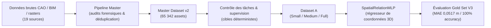

# 🏛️ AXIS

### Architectural eXpert Intelligence System

**🇫🇷 Français** | [🇬🇧 English](README_EN.md)

[](https://www.python.org/)
[](LICENSE)
[](REPRODUCIBILITY.md#4-automated-test-suite-what-actually-runs-on-a-fresh-clone)
[](DATASET.md)
[-orange.svg)](docs/experiments/RUN-023/README.md)
[](PROJECT_STATUS.md)
[](docs/SCIENTIFIC_TIMELINE.md)

> Projet de recherche open source visant à développer une intelligence artificielle spécialisée dans le raisonnement spatial, géométrique et architectural — publié sous licence MIT.

> **Dépôt officiel :** [github.com/EncoreZaan/AXIS](https://github.com/EncoreZaan/AXIS)  
> **Dernier jalon scientifique (2026-09-23) :** Évaluation de l'ancrage spatial Phase 6B ([`RUN-023`](docs/experiments/RUN-023/README.md)) — Gain de précision de +48,61 pp sur le modèle de base (63,12 %), mais dépendance visuelle **non prouvée** sous le protocole VDI officiel ($\text{VDI} = 1,28 < 3,0$).  
> **Évolution du projet :** AXIS est la suite publique du travail de recherche mené précédemment sous le nom de code `ARCHI-AI`. Toute la traçabilité scientifique historique est conservée intégralement — voir [`docs/history/project-history.md`](docs/history/project-history.md) et la [`Frise chronologique`](docs/SCIENTIFIC_TIMELINE.md).  
> **Nouveau sur le projet ?** Commencez par [`START_HERE.md`](START_HERE.md).

---

## ⚠️ Statut

**AXIS est actuellement un projet de recherche en développement actif.** Certaines capacités sont validées expérimentalement sur un périmètre étroit et précisément défini (voir [Résultats actuels](#-résultats-actuels)). Plusieurs axes majeurs restent expérimentaux, bloqués par la disponibilité ou la licence des données, ou simplement non commencés. AXIS n'est **pas** un modèle de production, et un résultat positif sur un benchmark restreint ne doit jamais être lu comme une preuve de compréhension générale de l'architecture. Voir [État actuel de la recherche](#-état-actuel-de-la-recherche) pour le détail complet, sans filtre.

---

## Table des matières

- [Qu'est-ce que AXIS ?](#-quest-ce-que-axis-)
- [Pourquoi AXIS ?](#-pourquoi-axis-)
- [Vision](#-vision)
- [État actuel de la recherche](#-état-actuel-de-la-recherche)
- [Résultats actuels & Jalons scientifiques](#-résultats-actuels)
- [Master Dataset v2](#-master-dataset-v2)
- [Architecture du système](#-architecture-du-système)
- [Structure du dépôt](#-structure-du-dépôt)
- [Reproduire les expériences](#-reproduire-les-expériences)
- [Politique de documentation](#-politique-de-documentation)
- [Roadmap](#-roadmap)
- [Contribuer](#-contribuer)
- [Limites scientifiques](#-limites-scientifiques)
- [Licence](#-licence)
- [Communauté & contact](#-communauté--contact)

---

## ✨ Qu'est-ce que AXIS ?

**AXIS (Architectural eXpert Intelligence System)** est une initiative de recherche scientifique ouverte visant à développer une intelligence artificielle spécialisée pour :

1. **Le raisonnement spatial** — comprendre les relations de coordonnées relatives, les distances euclidiennes 3D, les zones de dégagement et l'orientation dans des espaces intérieurs complexes.
2. **Le raisonnement géométrique** — lire, décoder et valider des plans architecturaux 2D et des modèles BIM (Building Information Modeling / IFC) en 3D.
3. **La compréhension architecturale et la conformité normative** — évaluer des conceptions au regard de standards professionnels et de réglementations ergonomiques (normes Neufert, seuils d'accessibilité PMR français).
4. **La synthèse multimodale ancrée** — relier plans 2D, modèles spatiaux 3D et spécifications textuelles structurées sans halluciner d'échelle physique.

Le code et la documentation originaux d'AXIS sont publiés sous **licence MIT**. Les jeux de données tiers utilisés ou référencés conservent leurs propres licences — voir [Licence](#-licence).

---

## 🎯 Pourquoi AXIS ?

Les grands modèles de langage (LLM) et modèles vision-langage (VLM) généralistes démontrent des capacités linguistiques et perceptives remarquables. Pourtant, dans le domaine architectural, ils échouent de façon récurrente sur des tâches physiques fondamentales :

* **Hallucination métrique :** les modèles inventent régulièrement des surfaces (m²) ou des épaisseurs de murs à partir de rasters 2D non calibrés, sans échelle physique de référence.
* **Incohérence topologique :** ils échouent à préserver les graphes de cloisonnement, confondant partitions non porteuses et murs structurels, ou générant des circulations discontinues.
* **Aveuglement normatif :** ils ne détectent pas de façon fiable qu'un passage de 85 cm viole une réglementation d'accessibilité PMR.
* **Raccourcis d'artefacts de dataset :** les modèles standards exploitent des raccourcis de métadonnées plutôt que d'apprendre une véritable géométrie spatiale.

**AXIS ne cherche pas à cloner un chatbot généraliste.** Le projet est construit depuis zéro pour explorer une intelligence architecturale spécialisée et mathématiquement fondée — s'appuyant sur des contrats de cibles falsifiables, des audits de données multi-dimensionnels, des découpages sans fuite (« zero-leakage splits ») et des benchmarks immuables.

---

## 🗺️ Vision

AXIS vise à terme un système capable d'assister la conception, la vérification et la compréhension architecturale de façon fiable et vérifiable — pas en imitant le langage de l'architecture, mais en raisonnant réellement sur sa géométrie, ses contraintes physiques et ses normes. C'est un objectif à long terme, poursuivi étape par étape, chaque capacité devant être prouvée sur un benchmark adversarial avant d'être déclarée acquise (voir [Fondements scientifiques](RESEARCH.md)). Le projet privilégie explicitement l'honnêteté scientifique à la vitesse d'annonce : une capacité non démontrée est documentée comme telle, jamais présentée comme acquise.

---

## 🔬 État actuel de la recherche

Le projet distingue strictement ce qui est validé, expérimental, bloqué ou simplement planifié :

| Sous-système / Jalon | Statut | Description |
| :--- | :---: | :--- |
| **Master Dataset v2** | ✅ `DONE` | **65 342 assets uniques** sur 19 sources. 0 fuite SHA256, 0 fuite de projet. |
| **Partitionnement des données** | ✅ `DONE` | 53 720 train / 5 724 val / 5 898 test (= 65 342) + 1 563 en file de revue isolée. Seed = 42. |
| **Suite de tests automatisés** | 🟡 `PARTIEL` | 9/9 tests passent en CI autonome. Tests exhaustifs (99) requièrent l'environnement complet de données. |
| **Gold Set V3** | ✅ `DONE` | 200 instances certifiées + 200 négatifs adverses. Immuable, lecture seule. SHA256: `81561f...`. |
| **Benchmark Clearance (MLP)** | ✅ `DONE` | **MAE 0.0517 m** sur le Gold Set (vs Baseline 0 : 2,7739 m), réduction de **98,14 %**. Tâche étroite 3D. |
| **ResPlan (échelle métrique)** | 🔴 `BLOQUÉ` | Distorsion d'échelle prouvée sur 17k plans. Mis en quarantaine pour toute tâche métrique (m²). |
| **FloorPlanCAD** | 🔴 `BLOQUÉ` | 741 dessins vectoriels CAO en quarantaine légale (`PDR-2026-001`), exclus de tout entraînement. |
| **Phase 4: RUN-019 (Pilote Réel)** | ✅ `DONE` | Entraînement QLoRA 194 pas sur 1 000 plans réels. Loss divisée par 10 (-98.59 %). |
| **Phase 5: RUN-020 (Falsification)** | ❌ `FALSIFIÉ` | Révélation d'apprentissage par template (85.3 %) et cécité visuelle ($\text{VDI} \approx 1.0$). |
| **Phase 6A: RUN-021 (Dataset Spatial)**| ✅ `DONE` | 7 950 exemples de raisonnement spatial (100% `VISUAL_REQUIRED`). 0 fuite. Audit géométrique PASS. |
| **Phase 6B: RUN-022 (Pilote Grounding)**| ✅ `DONE` | Entraînement 2 310 pas (3 époques) sur Qwen2-VL-7B. Reprise déterministe au pas 750 validée. |
| **Phase 6B: RUN-023 (Évaluation)** | ⚠️ `COMPLÉTÉ` | Précision spatiale : **63,12 %** (+48,61 pp vs base), format 100 %, 0 % hallucination. **VDI : 1,28 (VDI_PASS : NON)**. |
| **Raisonnement multimodal 2D↔3D** | 🟡 `NON ÉVALUÉ` | En attente de paires IFC OpenBIM réelles supplémentaires sous licence libre. |
| **Prochaine étape autorisée** | 🛑 `EN ATTENTE` | Revue humaine obligatoire avant toute nouvelle phase d'entraînement. |

Détail complet et sources vérifiables : [`PROJECT_STATUS.md`](PROJECT_STATUS.md), [`SCIENTIFIC_TIMELINE.md`](docs/SCIENTIFIC_TIMELINE.md), et [`GATES_AND_DECISIONS.md`](docs/GATES_AND_DECISIONS.md).

Détail complet et sources vérifiables : [`PROJECT_STATUS.md`](PROJECT_STATUS.md).

---

## 📊 Résultats actuels

Lors de la **Phase 4 (étape 6)**, le checkpoint sélectionné **`ARCHI-AI-P4-005`** (entraîné sur Dataset A-Full, seed 42) a été évalué sur le Gold Set V3 sanctuarisé.

### Tâche `CLEARANCE_CHECK` (n = 100)

```text
========================================================================================
MODÈLE / CONFIGURATION            MAE (m)       MÉDIANE (m)   RMSE (m)      GAIN VS B0
========================================================================================
Baseline 0 (constante triviale)   2,7739 m      1,2200 m      3,8649 m      Référence
Modèle A-Small (001)              0,4663 m      0,2609 m      0,7887 m      +83,19%
Modèle A-Medium (004)             0,1699 m      0,1082 m      0,2712 m      +93,87%
Checkpoint sélectionné A-Full(005)0,0517 m      0,0412 m      0,0703 m      +98,14%
========================================================================================
```

* **Réduction d'erreur absolue :** −2,7222 m par rapport à Baseline 0.
* **Écart Validation → Gold Set :** +0,0036 m (MAE validation 0,0481 m → MAE Gold 0,0517 m). Il s'agit de l'écart entre deux ensembles indépendants tenus à l'écart de l'entraînement, pas d'un « generalization gap » classique train/test — voir [`EVALUATION.md`](EVALUATION.md#31-task-1-clearance_check-n--100).
* **Précision de classification normative (Pass/Fail) : 100,00 %** (99 TP / 0 FP / 1 TN / 0 FN sur n = 100).

> ⚠️ **Ce chiffre de 100 % doit être lu avec prudence.** L'ensemble de test comporte 99 positifs pour 1 seul négatif : une stratégie triviale consistant à toujours répondre « PASS » obtiendrait déjà 99 % de précision. Ce résultat ne constitue donc **pas** une preuve de robustesse générale du classifieur, et encore moins une preuve d'une quelconque « compréhension de l'architecture » par le modèle. Il démontre une régression spatiale précise sur une tâche étroite et bien définie (`CLEARANCE_CHECK`), rien de plus. Détail statistique complet : [`EVALUATION.md` §3.2](EVALUATION.md#32-why-100-accuracy-is-not-a-robustness-proof).

Le checkpoint entraîné n'est **pas publiquement disponible** (voir [`EVALUATION.md` §4](EVALUATION.md#4-artifact-availability)). Le hash SHA256 est documenté pour la traçabilité scientifique uniquement.

### Évaluation VLM d'Ancrage Spatial Phase 6B (`RUN-023`)

Sur le modèle vision-langage `Qwen/Qwen2-VL-7B-Instruct` adapté en 4-bit NF4 (`final_adapter`, SHA-256: `71c3f3eaf8de758bc9c843fdb70c6c03538789a7c1fddc7ab1af198b40ee8479`), l'évaluation sur **1 006 exemples de test tenus à l'écart** ([`RUN-023`](docs/experiments/RUN-023/README.md)) a mesuré :

```text
========================================================================================
DIMENSION ÉVALUÉE                  BASE MODEL      RUN-019 PILOTE    RUN-022 (PHASE 6B)
========================================================================================
Relations Directionnelles          3,20 %          10,40 %           98,40 % (+95,2 pp)
Connectivité Portes (Pos/Nég)      50,00 %         50,40 %           94,00 % (+44,0 pp)
Adjacence Topologique              0,00 %          0,00 %            94,00 % (+94,0 pp)
Cardinalité Pièces & Portes        6,40 %          8,00 %            69,20 % (+61,2 pp)
Chemin le Plus Court (Multi-Hop)   0,00 %          0,00 %            80,00 % (+80,0 pp)
Noyau de Circulation Central       0,00 %          0,00 %            0,00 %  (sensibilité métrique)
----------------------------------------------------------------------------------------
PRÉCISION D'ANCRAGE GLOBALE        14,51 %         15,81 %           63,12 % (+48,61 pp)
ADHÉRENCE DE FORMAT / SYNTAXE      65,61 %         56,06 %           100,00 %
TAUX D'HALLUCINATION D'ID          0,00 %          100,00 %          0,00 % (éradiqué)
REPRODUCTIBILITÉ (SEED 42)         —               —                 100 % (20/20 bit-exact)
========================================================================================
INDICE DE DÉPENDANCE VISUELLE (VDI):  1,28  (Seuil requis: >= 3,0  |  VERDICT: NON / FAIL)
ABLATIONS: Original 64% | Noir 50% | Masque 46% | Bruit 51% | Texte seul 47%
========================================================================================
```

> ⚠️ **Limites méthodologiques & Honnêteté scientifique :**
> 1. **Dépendance visuelle non démontrée ($\text{VDI} = 1,28 < 3,0$) :** Le modèle réussit de façon spectaculaire les requêtes relationnelles discrètes, mais l'évaluation par ablation d'image montre un plancher de 50 % sur les questions binaires et une présence de coordonnées textuelles dans les prompts permettant une inférence linguistique sans regarder l'image. L'ancrage purement visuel n'est donc **pas prouvé**.
> 2. **Noyau de circulation (0,00 %) :** L'évaluation imposait une égalité entière stricte sur la boîte englobante 4-tuple. Les prédictions du modèle identifiaient correctement l'espace et le nombre de portes, mais divergeaient de quelques pixels d'arrondi. Conformément à nos règles de traçabilité, cette métrique n'a pas été modifiée rétroactivement.
> 3. **Revue humaine aveugle :** `HUMAN_BLIND_EVALUATION = NOT_PERFORMED`. L'analyse qualitative est une compilation comparative automatisée.
> 
> Voir le rapport complet : [`docs/experiments/RUN-023/README.md`](docs/experiments/RUN-023/README.md).

---

## 📦 Master Dataset v2

Le Master Dataset v2 est compilé à partir de **19 dépôts physiques indépendants** et comprend **65 342 assets uniques** :

* **Splits :** train 53 720 / validation 5 724 / test 5 898 / revue (isolée) 1 563.
* **Garantie anti-fuite :** zéro fuite SHA256, zéro fuite de projet entre splits.
* **Quarantaines connues :**
  - `CORE_RESPLAN` : 17 000 plans vectoriels mis en quarantaine pour tout calcul métrique (échelle de canevas non uniforme).
  - `CORE_FLOORPLANCAD` : 741 dessins vectoriels en attente de revue légale.
  - `CORE_RESBIM_PAIRED` : seulement 10 paires 2D↔3D réellement appariées existent dans le corpus brut.

Registre complet des sources, schémas et licences : [`DATASET.md`](DATASET.md). Séparation licence code / licence données : [`THIRD_PARTY_LICENSES.md`](THIRD_PARTY_LICENSES.md).

---

## 🏗️ Architecture du système



Diagrammes de sous-systèmes détaillés : [`ARCHITECTURE.md`](ARCHITECTURE.md).

---

## 📁 Structure du dépôt

```text
AXIS/
├── README.md                      # Ce document (français)
├── README_EN.md                   # Version anglaise
├── START_HERE.md                  # Point d'entrée pour les nouveaux venus
├── LICENSE                        # Licence MIT (code AXIS original)
├── THIRD_PARTY_LICENSES.md        # Séparation code MIT / données tierces
├── CONTRIBUTING.md                # Guide de contribution
├── CODE_OF_CONDUCT.md             # Code de conduite (Contributor Covenant 2.1)
├── SECURITY.md                    # Politique de signalement de sécurité
├── GOVERNANCE.md                  # Modèle de gouvernance
├── CITATION.cff                   # Métadonnées de citation académique
├── ROADMAP.md                     # Feuille de route (terminé / en cours / bloqué / planifié)
├── PROJECT_STATUS.md              # Matrice de statut faisant autorité (2026-09-23)
├── CHANGELOG.md                   # Historique des versions
├── RESEARCH.md                    # Méthodologie scientifique et falsifiabilité
├── ARCHITECTURE.md                # Architecture du système et pipeline de données
├── DATASET.md                     # Documentation du Master Dataset v2
├── EVALUATION.md                  # Protocole de benchmark et métriques certifiées
├── EXPERIMENTS.md                 # Registre des runs et ablations
├── DEVELOPMENT.md                 # Guide développeur
├── REPRODUCIBILITY.md             # Guide de reproduction
├── pyproject.toml / requirements.txt
├── RUN-019-FIRST-REAL-DATA-QLORA/ # Éléments probants Phase 4 (Pilote réel)
├── RUN-020-SCIENTIFIC-GENERALIZATION/ # Éléments probants Phase 5 (Falsification)
├── RUN-021-SPATIAL-SUPERVISION/   # Dataset de supervision spatiale verrouillé
├── RUN-022-SPATIAL-GROUNDING-PILOT/ # Checkpoints & métriques entraînement Phase 6B
├── RUN-023-SPATIAL-GENERALIZATION-EVAL/ # Évaluation complète & ablations visuelles
├── dataset_tools/                 # Ingestion, validation, constructeur spatial
├── evaluation/                    # Harnais de benchmark et baselines
├── experiment_package/            # Reproduction portable du micro-pilote QLoRA
├── tests/                         # Suite de tests automatisés
├── configs/                       # Fichiers de configuration
├── scripts/                       # Scripts d'entraînement, audit et évaluation
└── docs/
    ├── DOCUMENTATION_POLICY.md    # Politique stricte d'archivage scientifique
    ├── PROJECT_STATUS.md          # Statut scientifique détaillé & 11 invariants
    ├── SCIENTIFIC_TIMELINE.md     # Frise chronologique complète Phases 1-6B
    ├── GATES_AND_DECISIONS.md     # Registre des portes de décision et audits
    ├── experiments/               # Documentation détaillée des runs (RUN-019 à RUN-023)
    ├── datasets/                  # Audits, matrices d'acquisition, licences, PDR
    ├── evaluation/                # Audits indépendants du Gold Set
    └── research/                  # Rapports de recherche et readiness scientifique
```

---

## 📜 Politique de documentation

Le projet applique une règle de traçabilité absolue ([`docs/DOCUMENTATION_POLICY.md`](docs/DOCUMENTATION_POLICY.md)) :

> **« Une exécution scientifique sans documentation d'archivage n'est pas considérée comme terminée. »**

Chaque expérience (entraînement, évaluation, ablation) doit impérativement faire l'objet d'un rapport dédié, d'un scellement cryptographique des métriques (`hashes.json`), d'une mise à jour de la frise chronologique et d'un commit Git dédié avant toute autorisation de l'étape suivante. Tout résultat négatif ou défavorable doit être consigné avec la même visibilité qu'un résultat positif.

---

---

## 🔬 Reproduire les expériences

### 1. Installation

```bash
git clone https://github.com/EncoreZaan/AXIS.git
cd AXIS

python -m venv .venv
source .venv/bin/activate  # Windows : .venv\Scripts\Activate.ps1

pip install -r requirements.txt
pip install -e .
```

Cette installation a été testée sur un clone neuf sans dépendances préexistantes.

### 2. Environnement

Python 3.10 ou 3.11. Voir [`requirements.txt`](requirements.txt) et les extras `dataset` / `vlm` / `dev` de [`pyproject.toml`](pyproject.toml).

### 3. Datasets — ce qui est public vs privé

* **Reproductible immédiatement :** le code d'ingestion, les schémas, les scripts de validation, et les tests qui ne dépendent pas du corpus privé.
* **Non reproductible sans données tierces :** le corpus brut complet (RPLAN, IL3D, etc.) n'est **pas redistribué** dans ce dépôt (voir [`DATASET.md` §5](DATASET.md#5-data-access-policy)). Un contributeur peut reconstruire le Master Dataset v2 en récupérant chaque source publique séparément puis en exécutant `dataset_tools/acquisition/`.

### 4. Gold Set V3 et checkpoint

Ni le Gold Set V3 ni le checkpoint `ARCHI-AI-P4-005` ne sont publiquement téléchargeables (`.gitignore` exclut `dataset/`, `*.pt`, `outputs/`). Ceci est documenté explicitement, pas caché : voir [`EVALUATION.md` §4](EVALUATION.md#4-artifact-availability) et [`REPRODUCIBILITY.md` §2](REPRODUCIBILITY.md#2-reproducing-phase-4-step-6-gold-set-v3-evaluation).

### 5. Benchmarks

```bash
python scripts/evaluate_baseline.py --help
```

Baseline 0 (constante triviale) est exécutable directement sans données privées. Voir [`REPRODUCIBILITY.md`](REPRODUCIBILITY.md) pour la procédure complète.

### 6. Tests

```bash
pytest tests
```

> **Sur un clone neuf, sans le corpus privé :** sur 93 tests collectés, **35 passent, 19 échouent, 38 sont en erreur, 1 est ignoré** — vérifié directement sur un environnement vierge lors de cette publication. Le sous-ensemble de 9 tests strictement indépendant des données privées (`tests/test_audit_validators.py`, `tests/test_master_pipeline.py`) passe intégralement (9/9) et constitue le gate CI. Les 99 tests ne passent tous que dans l'environnement complet du mainteneur, avec le corpus privé présent localement. Détail complet : [`REPRODUCIBILITY.md` §4](REPRODUCIBILITY.md#4-automated-test-suite-what-actually-runs-on-a-fresh-clone).

### 7. Limites actuelles

- Le corpus brut privé et le checkpoint entraîné ne sont pas publics.
- `experiment_package/dataset/` (jeu d'exemples pour le dry-run QLoRA) n'existe pas dans le dépôt public — voir [`REPRODUCIBILITY.md` §3](REPRODUCIBILITY.md).
- ~~La convention de chemins historique `ARCHI_AI/` utilisée par certains scripts du micro-pilote nécessite une configuration manuelle locale~~ — **corrigé** : ces scripts résolvent désormais leurs chemins depuis la racine du dépôt sans configuration manuelle. Voir [`DATASET.md` §6](DATASET.md#6-local-directory-convention-for-the-full-pipeline-historical--resolved) pour l'historique.

---

## 🗺️ Roadmap

✅ Terminé · 🟡 En cours / expérimental · 🔴 Bloqué · 🔵 Planifié

Voir [`ROADMAP.md`](ROADMAP.md) pour le détail complet des phases, avec diagramme et description de chaque jalon.

---

## 🤝 Contribuer

AXIS accueille les contributions de chercheurs en IA/ML, ingénieurs logiciels, chercheurs en vision par ordinateur, spécialistes BIM/IFC/OpenBIM, spécialistes CAO/géométrie, architectes, étudiants, ingénieurs GPU, et toute personne souhaitant reproduire ou prolonger les expériences.

**Pour commencer :**
1. Lisez [`START_HERE.md`](START_HERE.md) pour une vue d'ensemble en quelques minutes.
2. Lisez [`docs/CONTRIBUTOR_GUIDE.md`](docs/CONTRIBUTOR_GUIDE.md) pour l'orientation détaillée (architecture du dépôt, premières contributions par niveau de difficulté).
3. Suivez le processus détaillé dans [`CONTRIBUTING.md`](CONTRIBUTING.md) (fork, installation, branche, développement, tests, pull request).

**Exemples de contributions possibles :** documentation, tests, datasets légalement redistribuables, benchmarks, modèles, outils BIM/IFC, géométrie, vision par ordinateur, machine learning, optimisation GPU, infrastructure, CI, correction de bugs, exemples, visualisations, reproductibilité scientifique.

Pour proposer une nouvelle expérience scientifique, suivez [`docs/RESEARCH_CONTRIBUTION_PROTOCOL.md`](docs/RESEARCH_CONTRIBUTION_PROTOCOL.md).

---

## ⚠️ Limites scientifiques

1. **Périmètre géométrique étroit :** le checkpoint `005` démontre une régression spatiale de dégagement 3D à haute précision. Ce n'est **pas** un assistant architectural généraliste.
2. **Rareté des paires multimodales :** le corpus brut ne contient que 10 paires réelles 2D↔3D. Le pré-entraînement multimodal complet est bloqué tant que 50 à 100 modèles IFC OpenBIM sous licence permissive ne sont pas intégrés.
3. **Quarantaine métrique ResPlan :** les données vectorielles ResPlan ne peuvent pas être utilisées pour des calculs de surface (m²) en raison d'une normalisation d'échelle non calibrée.
4. **Quarantaine légale FloorPlanCAD :** 741 dessins vectoriels CAO restent en quarantaine dans l'attente d'une revue légale.
5. **Pre-Training Gate bloqué :** le statut formel reste `CONDITIONAL` (`TRAINING_ALLOWED: NO`).
6. **Historique Git limité :** ce dépôt ne contient pas l'historique incrémental complet des phases 0 à 4 — voir [`docs/history/project-history.md`](docs/history/project-history.md) pour le contexte.

AXIS n'est **pas** prêt pour la production, n'est **pas** un modèle de fondation généraliste, et aucune capacité démontrée ici ne doit être extrapolée au-delà de son périmètre exact et vérifié.

---

## 🔓 Licence

Le **code original AXIS** (scripts, outils, configuration, documentation de ce dépôt) est publié sous **licence MIT** — voir [`LICENSE`](LICENSE).

Cette licence **ne s'applique pas** aux jeux de données tiers, images, modèles pré-entraînés, checkpoints, ou toute autre ressource appartenant à des tiers (RPLAN, IL3D, FloorPlanCAD, ResPlan, données OpenBIM externes, etc.). Ces ressources conservent leur propre licence d'origine et ne sont ni redistribuées ni relicenciées par AXIS. Voir [`THIRD_PARTY_LICENSES.md`](THIRD_PARTY_LICENSES.md) pour le détail complet source par source, et [`DATASET.md`](DATASET.md) pour le registre des sources.

| Notion | Statut |
| :--- | :--- |
| **Visibilité du dépôt** | Public sur GitHub. |
| **Licence du code AXIS** | **MIT.** |
| **Licences des datasets tiers** | Variables selon la source (voir `DATASET.md`, colonne « Primary License ») ; non modifiées par la licence MIT d'AXIS. Certaines sont explicitement `LEGAL_REVIEW_REQUIRED`. |
| **Checkpoints / poids de modèle** | Non publiés actuellement (voir `EVALUATION.md` §4) ; leur licence future, si publication il y a, sera précisée à ce moment-là. |

---

## 👥 Communauté & contact

* **Responsable du projet :** EncoreZaan (`teobarreau7@gmail.com`)
* **Communauté :** partagé au sein de communautés de recherche IA (dont groupes de travail Renaud Dékode et OpenBIM).
* **Issues & discussions :** [github.com/EncoreZaan/AXIS/issues](https://github.com/EncoreZaan/AXIS/issues)
* **Sécurité :** voir [`SECURITY.md`](SECURITY.md) pour le signalement responsable de vulnérabilités.
* **Code de conduite :** voir [`CODE_OF_CONDUCT.md`](CODE_OF_CONDUCT.md).
