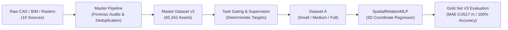

# 🏛️ AXIS

### Architectural eXpert Intelligence System

[🇫🇷 Français](README.md) | **🇬🇧 English**

[](https://www.python.org/)
[](LICENSE)
[](REPRODUCIBILITY.md#4-automated-test-suite-what-actually-runs-on-a-fresh-clone)
[](DATASET.md)
[](EVALUATION.md)
[](PROJECT_STATUS.md)

> An open-source research project developing specialized artificial intelligence for spatial, geometric, and architectural reasoning — released under the MIT License.

> **Official repository:** [github.com/EncoreZaan/AXIS](https://github.com/EncoreZaan/AXIS)
> **Project evolution:** AXIS is the public continuation of research previously conducted under the internal codename `ARCHI-AI`. All historical scientific provenance (identifiers, hashes, run logs) is preserved in full — see [`docs/history/project-history.md`](docs/history/project-history.md).
> **New here?** Start with [`START_HERE.md`](START_HERE.md).

---

## ⚠️ Status

**AXIS is currently an active research project under development.** Some capabilities are experimentally validated within a narrow, precisely defined scope (see [Current Results](#-current-results)). Several major research directions remain experimental, blocked by data availability or licensing, or simply not yet started. AXIS is **not** a production model, and a single positive result on a narrow benchmark should never be read as proof of general architectural understanding. See [Current Research Status](#-current-research-status) for the full, unfiltered breakdown.

---

## Table of Contents

- [What is AXIS?](#-what-is-axis)
- [Why AXIS?](#-why-axis)
- [Vision](#-vision)
- [Current Research Status](#-current-research-status)
- [Current Results](#-current-results)
- [Master Dataset v2](#-master-dataset-v2)
- [System Architecture](#-system-architecture)
- [Repository Structure](#-repository-structure)
- [Reproducing the Experiments](#-reproducing-the-experiments)
- [Roadmap](#-roadmap)
- [Contributing](#-contributing)
- [Scientific Limitations](#-scientific-limitations)
- [License](#-license)
- [Community & Contact](#-community--contact)

---

## ✨ What is AXIS?

**AXIS (Architectural eXpert Intelligence System)** is an open scientific research initiative developing specialized artificial intelligence for:

1. **Spatial reasoning** — understanding relative coordinate relationships, 3D Euclidean distances, clearance zones, and orientation in complex interior spaces.
2. **Geometric reasoning** — reading, decoding, and validating 2D architectural floorplans and 3D Building Information Models (BIM / IFC).
3. **Architectural understanding & normative compliance** — evaluating designs against professional building standards and ergonomic regulations (Neufert standards, French accessibility/PMR thresholds).
4. **Grounded multimodal synthesis** — bridging 2D floorplans, 3D spatial models, and structured textual specifications without hallucinating physical scale.

The original AXIS code and documentation are released under the **MIT License**. Third-party datasets used or referenced by the project retain their own licenses — see [License](#-license).

---

## 🎯 Why AXIS?

General-purpose Large Language Models (LLMs) and Vision-Language Models (VLMs) demonstrate remarkable linguistic and perceptual abilities. In architectural domains, however, they consistently fail at fundamental physical tasks:

* **Metric hallucination:** models routinely invent surface areas (m²) or wall thicknesses from uncalibrated 2D pixel rasters, with no physical ground scale.
* **Topological incoherence:** they fail to preserve partition graphs, confusing non-bearing partitions with structural walls or generating discontinuous circulation routes.
* **Normative blindness:** they cannot reliably detect that an 85 cm passage violates wheelchair accessibility regulations.
* **Dataset artifact shortcuts:** standard models exploit metadata shortcuts (typical room dimensions, file names) rather than learning true spatial geometry.

**AXIS does not attempt to clone a generalist chat model.** It is built from the ground up to explore specialized, mathematically grounded architectural intelligence — relying on falsifiable target contracts, multi-dimensional data audits, zero-leakage splits, and immutable benchmarks.

---

## 🗺️ Vision

AXIS aims, over the long term, at a system capable of reliably and verifiably assisting architectural design, verification, and understanding — not by imitating the language of architecture, but by genuinely reasoning about its geometry, physical constraints, and regulations. This is a long-horizon goal pursued incrementally: every capability must be proven on an adversarial benchmark before being declared acquired (see [Scientific Foundations](RESEARCH.md)). The project explicitly prioritizes scientific honesty over announcement speed: an undemonstrated capability is documented as such, never presented as achieved.

---

## 🔬 Current Research Status

The project strictly distinguishes what is validated, experimental, blocked, or merely planned:

| Subsystem / Milestone | Status | Description |
| :--- | :---: | :--- |
| **Master Dataset v2** | ✅ `DONE` | **65,342 unique assets** across 19 sources. 0 SHA256 leaks, 0 project leaks. |
| **Data partitioning** | ✅ `DONE` | 53,720 train / 5,724 val / 5,898 test (= 65,342) + 1,563 held in an isolated review queue (not summed into the total). Seed = 42. |
| **Automated test suite** | 🟡 `PARTIAL` | 93 tests collected on a fresh clone with no private data: **35 pass, 19 fail, 38 error, 1 skipped** — all failures/errors trace to private data that is not redistributed. The data-independent subset (9 tests) passes 9/9 in CI. |
| **Phase 4 task gating** | ✅ `DONE` | 4/69 tasks approved (`FLOORPLAN_READING`, `ROOM_TOPOLOGY`, `OBJECT_RELATION`, `CLEARANCE_CHECK`). 65 excluded. |
| **Gold Set V3** | ✅ `DONE` | 200 certified instances + 200 hard negatives. Immutable, read-only. **Not publicly downloadable.** |
| **Clearance benchmark** | ✅ `DONE` | **0.0517 m MAE** on the Gold Set (vs Baseline 0: 2.7739 m), a **98.14%** relative reduction. See statistical caveats below. |
| **ResPlan (metric scale)** | 🔴 `BLOCKED` | Scale distortion proven on 17k plans. Quarantined for all metric (m²) tasks. |
| **FloorPlanCAD** | 🔴 `BLOCKED` | 741 CAD vector drawings quarantined, pending legal review. |
| **2D vision model (`ROOM_TOPOLOGY`)** | 🟡 `NOT YET VALIDATED` | Baseline 0 calibrated (34% exact match). Model training scheduled for a later phase. |
| **VLM QLoRA proof-of-concept** | 🟡 `EXPERIMENTAL` | Dry-run and 6-step run on Qwen2-VL-7B (loss 1.893 → 1.769, 0 OOM). **Not a final model.** |
| **Multimodal 2D↔3D reasoning** | 🟡 `NOT YET VALIDATED` | Synthetic cross-modal training rejected due to raw pair rarity (only 10 true pairs). |
| **Pre-Training Gate** | 🔴 `BLOCKED` | Status `CONDITIONAL` (`TRAINING_ALLOWED: NO`) until 50–100 open-licensed OpenBIM IFC pairs are acquired. |
| **DSpark acceleration** | 🔵 `PLANNED` | Prospective research track; no claims before physical benchmarks. |

Full detail and verifiable sources: [`PROJECT_STATUS.md`](PROJECT_STATUS.md).

---

## 📊 Current Results

During **Phase 4, Step 6**, the selected checkpoint **`ARCHI-AI-P4-005`** (trained on Dataset A-Full, seed 42) was evaluated on the sanctified Gold Set V3.

### Task `CLEARANCE_CHECK` (n = 100)

```text
========================================================================================
MODEL / CONFIGURATION             MAE (m)       MEDIAN (m)    RMSE (m)      GAIN VS B0
========================================================================================
Baseline 0 (Trivial Constant)     2.7739 m      1.2200 m      3.8649 m      Reference
Model A-Small (001)               0.4663 m      0.2609 m      0.7887 m      +83.19%
Model A-Medium (004)              0.1699 m      0.1082 m      0.2712 m      +93.87%
Selected Checkpoint A-Full (005)  0.0517 m      0.0412 m      0.0703 m      +98.14%
========================================================================================
```

* **Absolute error reduction:** −2.7222 m relative to Baseline 0.
* **Validation → Gold Set MAE difference:** +0.0036 m (validation MAE 0.0481 m → Gold MAE 0.0517 m). This is the difference between two independently held-out sets, not a classical train/test generalization gap — see [`EVALUATION.md`](EVALUATION.md#31-task-1-clearance_check-n--100).
* **Normative verdict classification accuracy: 100.00%** (99 TP / 0 FP / 1 TN / 0 FN on n = 100).

> ⚠️ **This 100% figure must be read with caution.** The test set contains 99 positives and only 1 negative: a trivial "always PASS" strategy would already score 99%. This result is therefore **not** proof of general classifier robustness, and certainly not proof of any "understanding of architecture" by the model. It demonstrates precise spatial regression on one narrow, well-defined task (`CLEARANCE_CHECK`) — nothing more. Full statistical detail: [`EVALUATION.md` §3.2](EVALUATION.md#32-why-100-accuracy-is-not-a-robustness-proof).

The trained checkpoint is **not publicly available** (see [`EVALUATION.md` §4](EVALUATION.md#4-artifact-availability)). Its SHA256 hash is documented for scientific traceability only.

---

## 📦 Master Dataset v2

The Master Dataset v2 is compiled from **19 independent physical repositories** and comprises **65,342 unique assets**:

* **Splits:** train 53,720 / validation 5,724 / test 5,898 / isolated review queue 1,563.
* **Anti-leakage guarantee:** zero SHA256 leakage, zero project-group leakage across splits.
* **Known quarantines:**
  - `CORE_RESPLAN`: 17,000 vector plans quarantined from all metric calculations (non-uniform canvas scaling).
  - `CORE_FLOORPLANCAD`: 741 vector drawings pending legal review.
  - `CORE_RESBIM_PAIRED`: only 10 genuinely paired 2D↔3D examples exist in the raw corpus.

Full source registry, schemas, and licenses: [`DATASET.md`](DATASET.md). Code license vs. data license separation: [`THIRD_PARTY_LICENSES.md`](THIRD_PARTY_LICENSES.md).

---

## 🏗️ System Architecture



Detailed subsystem diagrams: [`ARCHITECTURE.md`](ARCHITECTURE.md).

---

## 📁 Repository Structure

```text
AXIS/
├── README.md                      # French README (primary)
├── README_EN.md                   # This document
├── START_HERE.md                  # Entry point for newcomers
├── LICENSE                        # MIT License (original AXIS code)
├── THIRD_PARTY_LICENSES.md        # MIT code vs. third-party data separation
├── CONTRIBUTING.md                # Contributor guide
├── CODE_OF_CONDUCT.md             # Contributor Covenant 2.1
├── SECURITY.md                    # Vulnerability reporting policy
├── GOVERNANCE.md                  # Governance model
├── CITATION.cff                   # Academic citation metadata
├── ROADMAP.md                     # Roadmap (done / in progress / blocked / planned)
├── PROJECT_STATUS.md              # Detailed status matrix
├── CHANGELOG.md                   # Release history
├── RESEARCH.md                    # Scientific methodology and falsifiability
├── ARCHITECTURE.md                # System architecture and data pipeline
├── DATASET.md                     # Master Dataset v2 documentation
├── EVALUATION.md                  # Benchmark protocol and certified metrics
├── EXPERIMENTS.md                 # Registry of runs and ablations
├── DEVELOPMENT.md                 # Developer guide
├── REPRODUCIBILITY.md             # Reproduction guide
├── pyproject.toml / requirements.txt
├── .github/                       # Issue/PR templates and CI
├── dataset_tools/                 # Ingestion, validation, supervision engine
├── evaluation/                    # Benchmark harnesses and baselines
├── experiment_package/            # Portable QLoRA micro-pilot reproduction
├── tests/                         # Automated test suite
├── configs/                       # Configuration files
├── scripts/                       # Entry-point scripts (build/evaluate/validate)
└── docs/
    ├── research/                  # Research reports and scientific readiness
    ├── datasets/                  # Audits, acquisition matrices, license audits
    ├── evaluation/                # Independent Gold Set audits
    ├── experiments/               # Ablation plans, phase selection reports
    ├── history/                   # Historical traceability (codename ARCHI-AI)
    ├── CONTRIBUTOR_GUIDE.md       # Orientation guide for new contributors
    └── RESEARCH_CONTRIBUTION_PROTOCOL.md  # Protocol for proposing an experiment
```

---

## 🔬 Reproducing the Experiments

### 1. Installation

```bash
git clone https://github.com/EncoreZaan/AXIS.git
cd AXIS

python -m venv .venv
source .venv/bin/activate  # Windows: .venv\Scripts\Activate.ps1

pip install -r requirements.txt
pip install -e .
```

This install path was verified end-to-end on a fresh clone with no pre-existing environment.

### 2. Environment

Python 3.10 or 3.11. See [`requirements.txt`](requirements.txt) and the `dataset` / `vlm` / `dev` extras in [`pyproject.toml`](pyproject.toml).

### 3. Datasets — What's Public vs. Private

* **Immediately reproducible:** the ingestion code, schemas, validation scripts, and the subset of tests that do not depend on the private corpus.
* **Not reproducible without third-party data:** the full raw corpus (RPLAN, IL3D, etc.) is **not redistributed** in this repository (see [`DATASET.md` §5](DATASET.md#5-data-access-policy)). A contributor can rebuild the Master Dataset v2 by acquiring each public source independently and running `dataset_tools/acquisition/`.

### 4. Gold Set V3 and Checkpoint

Neither the Gold Set V3 nor checkpoint `ARCHI-AI-P4-005` is publicly downloadable (`.gitignore` excludes `dataset/`, `*.pt`, `outputs/`). This is stated explicitly, not hidden: see [`EVALUATION.md` §4](EVALUATION.md#4-artifact-availability) and [`REPRODUCIBILITY.md` §2](REPRODUCIBILITY.md#2-reproducing-phase-4-step-6-gold-set-v3-evaluation).

### 5. Benchmarks

```bash
python scripts/evaluate_baseline.py --help
```

Baseline 0 (trivial constant) runs directly with no private data required. See [`REPRODUCIBILITY.md`](REPRODUCIBILITY.md) for the full procedure.

### 6. Tests

```bash
pytest tests
```

> **On a fresh clone, without the private corpus:** out of 93 tests collected, **35 pass, 19 fail, 38 error, and 1 is skipped** — verified directly on a clean environment as part of this release. The 9-test subset that is strictly independent of private data (`tests/test_audit_validators.py`, `tests/test_master_pipeline.py`) passes in full (9/9) and is the CI gate. All 99 tests pass only in the maintainer's full local environment, with the private corpus present. Full breakdown: [`REPRODUCIBILITY.md` §4](REPRODUCIBILITY.md#4-automated-test-suite-what-actually-runs-on-a-fresh-clone).

### 7. Current Limitations

- The private raw corpus and the trained checkpoint are not public.
- `experiment_package/dataset/` (the example set for the QLoRA dry-run) does not exist in the public repository — see [`REPRODUCIBILITY.md` §3](REPRODUCIBILITY.md).
- The historical `ARCHI_AI/` path convention used by some micro-pilot scripts requires manual local setup — see [`DATASET.md` §6](DATASET.md#6-local-directory-convention-for-the-full-pipeline).

---

## 🗺️ Roadmap

✅ Done · 🟡 In progress / experimental · 🔴 Blocked · 🔵 Planned

See [`ROADMAP.md`](ROADMAP.md) for the full phase breakdown, with diagram and per-milestone description.

---

## 🤝 Contributing

AXIS welcomes contributions from AI/ML researchers, software engineers, computer vision researchers, BIM/IFC/OpenBIM specialists, CAD/geometry specialists, architects, students, GPU/optimization engineers, and anyone interested in reproducing or extending the experiments.

**To get started:**
1. Read [`START_HERE.md`](START_HERE.md) for a five-minute overview.
2. Read [`docs/CONTRIBUTOR_GUIDE.md`](docs/CONTRIBUTOR_GUIDE.md) for detailed orientation (repository architecture, first contributions by difficulty level).
3. Follow the detailed process in [`CONTRIBUTING.md`](CONTRIBUTING.md) (fork, install, branch, develop, test, pull request).

**Examples of contributions:** documentation, tests, legally redistributable datasets, benchmarks, models, BIM/IFC tooling, geometry, computer vision, machine learning, GPU optimization, infrastructure, CI, bug fixes, examples, visualizations, scientific reproducibility.

To propose a new scientific experiment, follow [`docs/RESEARCH_CONTRIBUTION_PROTOCOL.md`](docs/RESEARCH_CONTRIBUTION_PROTOCOL.md).

---

## ⚠️ Scientific Limitations

1. **Narrow geometric scope:** checkpoint `005` demonstrates high-precision 3D spatial clearance regression. It is **not** a generalist architectural assistant.
2. **Multimodal pairing rarity:** the raw corpus contains only 10 genuine 2D↔3D pairs. Full multimodal pre-training is blocked until 50–100 permissively-licensed OpenBIM IFC models are integrated.
3. **ResPlan metric quarantine:** ResPlan vector data cannot be used for surface area (m²) calculations due to uncalibrated canvas normalization.
4. **FloorPlanCAD legal quarantine:** 741 CAD vector drawings remain quarantined pending legal review.
5. **Pre-Training Gate blocked:** formal status remains `CONDITIONAL` (`TRAINING_ALLOWED: NO`).
6. **Limited Git history:** this repository does not contain the full incremental history of Phases 0–4 — see [`docs/history/project-history.md`](docs/history/project-history.md) for context.

AXIS is **not** production-ready, is **not** a generalist foundation model, and no capability demonstrated here should be extrapolated beyond its exact, verified scope.

---

## 🔓 License

The **original AXIS code** (scripts, tooling, configuration, and documentation in this repository) is released under the **MIT License** — see [`LICENSE`](LICENSE).

This license **does not apply** to third-party datasets, images, pretrained models, checkpoints, or any other resource owned by third parties (RPLAN, IL3D, FloorPlanCAD, ResPlan, external OpenBIM data, etc.). Those resources retain their own original license and are neither redistributed nor relicensed by AXIS. See [`THIRD_PARTY_LICENSES.md`](THIRD_PARTY_LICENSES.md) for the full source-by-source breakdown, and [`DATASET.md`](DATASET.md) for the source registry.

| Notion | Status |
| :--- | :--- |
| **Repository visibility** | Public on GitHub. |
| **AXIS code license** | **MIT.** |
| **Third-party dataset licenses** | Vary by source (see `DATASET.md`, "Primary License" column); not modified by AXIS's MIT license. Some are explicitly `LEGAL_REVIEW_REQUIRED`. |
| **Model checkpoints / weights** | Not currently released publicly (see `EVALUATION.md` §4); their future license, if released, will be stated at that time. |

---

## 👥 Community & Contact

* **Project Lead:** EncoreZaan (`teobarreau7@gmail.com`)
* **Community:** shared within AI research communities (including Renaud Dékode and OpenBIM working groups).
* **Issues & discussions:** [github.com/EncoreZaan/AXIS/issues](https://github.com/EncoreZaan/AXIS/issues)
* **Security:** see [`SECURITY.md`](SECURITY.md) for responsible vulnerability disclosure.
* **Code of Conduct:** see [`CODE_OF_CONDUCT.md`](CODE_OF_CONDUCT.md).
