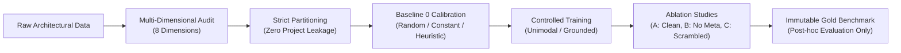

# AXIS — Scientific Research Foundations & Methodology

> **Project:** AXIS — Architectural eXpert Intelligence System  
> **Scientific Lead:** EncoreZaan  
> **Core Principle:** Falsifiable, reproducible, and anti-shortcut architectural artificial intelligence.

---

## 1. Scientific Mission & Problem Statement

Generalist Large Multimodal Models (LMMs) exhibit severe shortcomings when applied to architectural and spatial reasoning:
1. **The Metric Hallucination Trap:** Models routinely hallucinate metric dimensions (such as square meters or ceiling heights) from uncalibrated 2D pixel rasters where no ground scale exists.
2. **Topological Incoherence:** Models confuse visual line thickness with structural load-bearing capacity and fail to preserve connected interior partition graphs.
3. **Ergonomic & Normative Blindness:** Models struggle with strict Euclidean clearance thresholds (e.g. wheelchair circulation $\ge 0.90$ m, passage widths $\ge 0.80$ m) required by professional building regulations.
4. **Synthetic Shortcut Exploitation:** Models frequently memorize dataset-specific metadata artifacts (such as file names or class distribution modes) rather than learning intrinsic geometric relationships.

**AXIS** is designed to explore whether specialized artificial intelligence can overcome these limitations by grounding architectural reasoning in mathematically deterministic geometric targets, physical coordinate systems, and certified building information models (BIM / IFC).

---

## 2. Research Philosophy

### 2.1. Falsifiability & Baseline 0
No performance metric is reported in isolation. Every evaluation must compare against **Baseline 0**:
- **Baseline 0.1 (Stochastic):** Uniform sampling across target range.
- **Baseline 0.2 (Empirical Constant / Majority):** Training set median or majority class.
- **Baseline 1 (Heuristic):** Simple non-parametric geometric rule.
A model is only considered to have acquired signal if it demonstrates statistically significant separation from Baseline 0.

### 2.2. The Three-Condition Ablation Protocol
To verify that models learn genuine spatial geometry rather than metadata shortcuts:
- **Condition A (Full/Clean):** Raw inputs stripped of secondary identifying paths.
- **Condition B (Metadata Sanitization):** Complete expulsion of all asset names, hashes, and source hints.
- **Condition C (Scrambled / Perturbation):** Permuted coordinates or masked visual tokens. Performance must collapse to Baseline 0 under Condition C, proving that the model relies on the authentic spatial signal.

---

## 3. Chronological Research Phases

### Phase 0: Hardware Feasibility & Architectural Architecture Audit
- Analyzed local compute constraints (NVIDIA GeForce RTX 4060 Ti 8 GB VRAM, Windows 11) and remote 24 GB GPU infrastructure.
- Evaluated feasibility of RWKV-7 2.9B state-tuning (concluded native BF16 is too tight on 8 GB without 4-bit quantization).
- Formulated strategy combining lightweight geometric heads (`SpatialRelationMLP`) with quantized vision-language backbones.

### Phase 1: Ingestion & Master Dataset v2 Infrastructure
- Consolidated 66,847 physical files across 19 sources into **Master Dataset v2 (65,342 assets)**.
- Established strict separation: **53,720 train / 5,724 validation / 5,898 test**, plus 1,563 items held in review.
- Certified zero SHA256 cryptographic leakage and zero project-group leakage.
- Automated 99 unit and integration tests under `pytest`.

### Phase 2: Supervision Engine & Red-Team Audit
- Built deterministic question-answering generation pipeline across architectural tasks.
- Subjected data to red-team audit, detecting and eliminating 41 harmful instances where raw pixel counts were mislabeled as physical square meters.
- Constructed Gold Set V2 with 200 certified instances.

### Phase 3: Corpus Expansion Forensic & ResPlan Calibration Audit
- **RAW Corpus Audit:** 66,847 files analyzed; confirmed that exactly 10 genuine 2D floorplan $\leftrightarrow$ 3D BIM pairs exist (`CORE_RESBIM_PAIRED`). Refused arbitrary synthetic cross-dataset pairings.
- **ResPlan Scale Forensic:** Analyzed 17,000 vector floorplans from `ResPlan.pkl`. Discovered that each plan had been independently normalized to an arbitrary canvas size $[0, 256.0]$, rendering area calculations invalid. **Quarantined ResPlan for all physical metric tasks (m²)** while validating 6 scale-invariant topological capabilities.
- **FloorPlanCAD Legal Quarantine:** Quarantined 741 CAD vector files under `LEGAL_REVIEW_REQUIRED`.
- **Pre-Training Gate:** Enacted formal gate decision `CONDITIONAL` (`TRAINING_ALLOWED: NO`) until 50-100 additional open-licensed OpenBIM IFC pairs are acquired.

### Phase 4: Controlled Unimodal Micro-Pilot & Gold Set V3
- **Catalog Gating:** 4/69 tasks selected (`FLOORPLAN_READING`, `ROOM_TOPOLOGY`, `OBJECT_RELATION`, `CLEARANCE_CHECK`); 65 excluded.
- **Dataset A Construction:** Assembled Small (800), Medium (2,400), and Full (6,000) datasets with strict project partitioning (`seed = 42`).
- **Gold Set V3 Sanctification:** 200 instances + 200 adversarial hard negatives locked in read-only evaluation.
- **Results:** Checkpoint `ARCHI-AI-P4-005` achieved **0.0517 m MAE** on Gold Set clearance regression (vs Baseline 0 **2.7739 m**, a **+98.14% relative error reduction**) and **100% accuracy** on regulatory clearance decisions.

---

## 4. Documented Micro-Experiments vs Final Model Distinctions

| Experiment Attribute | Phase 4 Micro-Pilot (`SpatialRelationMLP`) | VLM Micro-Experiment (Proof-of-Concept) | AXIS Final Production Model |
| :--- | :--- | :--- | :--- |
| **Model Type** | Lightweight Spatial Geometry MLP | `Qwen/Qwen2-VL-7B-Instruct` + LoRA | Full Multimodal Architectural Foundation Model |
| **Target Task** | `CLEARANCE_CHECK` / `OBJECT_RELATION` | Space analysis & visual understanding | Unified Architectural Reasoning (2D, 3D, BIM, Norms) |
| **Training Steps** | Complete training on Dataset A-Full (seed 42) | 6 steps (2 epochs, batch size 1, grad accum 8) | Large-scale multi-epoch pre-training & SFT |
| **Key Metrics** | **Val MAE: 0.0481 m, Gold MAE: 0.0517 m** | Train loss: 1.893 $\to$ 1.769, Eval loss: 1.854 $\to$ 1.829 | TBD |
| **Scientific Status** | **VALIDATED ON GOLD BENCHMARK** | **FEASIBILITY / PROOF-OF-CONCEPT ONLY** | **PLANNED / ROADMAP TARGET** |
