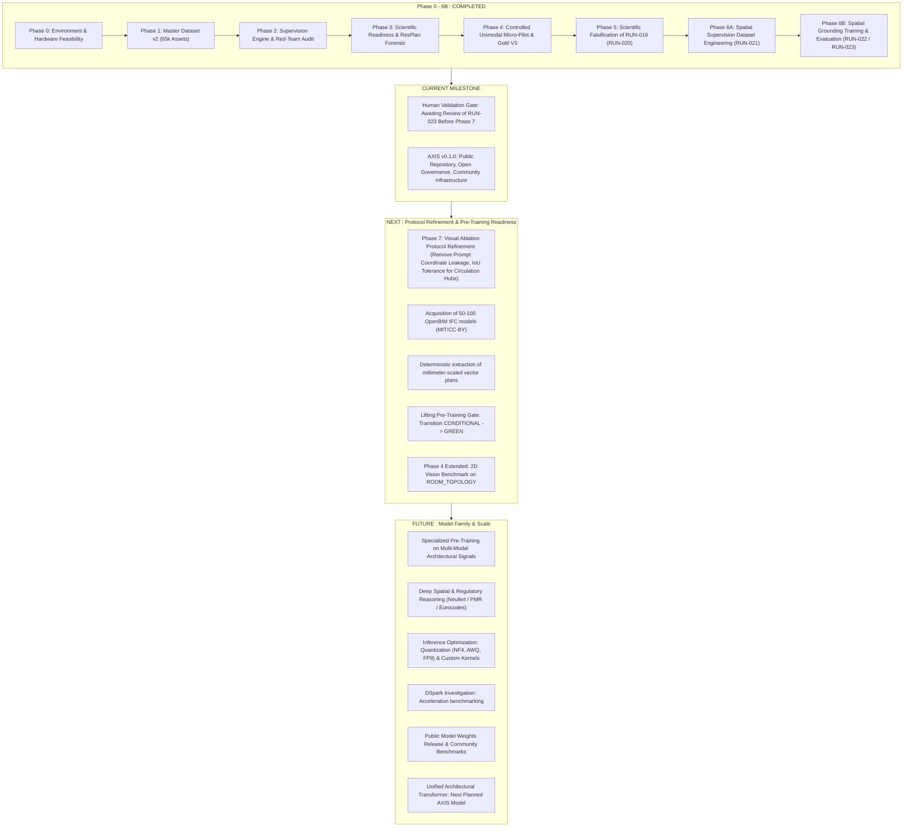

# AXIS — Scientific & Technical Roadmap

This roadmap details the progression of the **AXIS (Architectural eXpert Intelligence System)** research initiative. It distinguishes what has been empirically demonstrated, what is currently underway, and prospective milestones.

**Status legend:** ✅ Done · 🟡 In progress / experimental · 🔴 Blocked · 🔵 Planned (not started). These map directly onto the `DONE` / `IN PROGRESS` / `BLOCKED` / `PLANNED` descriptors used throughout [`PROJECT_STATUS.md`](PROJECT_STATUS.md). A `🔵 Planned` item is never described as done elsewhere in this repository, and this roadmap is updated whenever a milestone's real status changes — never the reverse.

---

## Roadmap Phases

---

## Detailed Milestone Descriptions

### 1. COMPLETED ✅
- [x] **Master Dataset v2 Closure:** Consolidated 65,342 unique assets across 19 sources with zero SHA256 and zero project leakage (`DATASET_SPLIT_REPORT.md`).
- [x] **Red-Team Quality & Harm Audit:** Identified and quarantined 41 harmful instances (pixel-as-m² confusion, fake multimodal dependencies).
- [x] **RAW Corpus Forensic Discovery:** Exhaustive scan of 66,847 files proving exactly 10 genuine 2D/3D pairs exist in RAW (`CORE_RESBIM_PAIRED`).
- [x] **ResPlan Metric Quarantine:** Quarantined 17,000 vector plans from metric calculation tasks due to arbitrary scale normalization; identified 6 safe scale-invariant topological capabilities.
- [x] **FloorPlanCAD Legal Quarantine:** Quarantined 741 vector drawings under `LEGAL_REVIEW_REQUIRED`.
- [x] **Phase 4 Task Gating:** Narrowed catalog to 4 strictly falsifiable tasks; excluded 65 tasks lacking deterministic grounding.
- [x] **Dataset A Construction:** Generated Small (800), Medium (2,400), and Full (6,000) subsets.
- [x] **Gold Set V3 Benchmark:** Sanctified 200 read-only instances + 200 adversarial hard negatives.
- [x] **Checkpoint `ARCHI-AI-P4-005` Validation:** Validated spatial clearance regression with **0.0517 m Gold MAE** vs Baseline 0 (**2.7739 m**), representing a **+98.14% relative improvement** and 100% normative accuracy.
- [x] **Micro-Experiment PoC:** Verified 4-bit NF4 QLoRA execution on Qwen2-VL-7B-Instruct (6 steps, 2 epochs, 0 OOM, 0 NaN).
- [x] **First Real-Data QLoRA Pilot (RUN-019):** Trained on 1,000 real architectural assets for 194 steps (2 epochs); validation loss reduced by 98.59%.
- [x] **Scientific Falsification of RUN-019 (RUN-020):** Independent generalization audit falsified the pilot's apparent success — 85.3% template reproduction, 100% ID hallucination, and near-zero visual dependency (VDI ≈ 1.0). This directly motivated a redesigned supervision protocol rather than being discarded as a failure.
- [x] **Spatial Supervision Dataset Engineering (RUN-021):** Designed and cryptographically locked `AXIS_SPATIAL_SUPERVISION_V1` (1,000 assets / 7,950 examples: 6,160 train / 784 validation / 1,006 test), specifically engineered to eliminate the shortcuts RUN-020 identified. Zero leakage confirmed.
- [x] **Spatial Grounding Pilot Training (RUN-022):** Fine-tuned `Qwen2-VL-7B-Instruct` + LoRA on the new protocol for 2,310 optimizer steps (3 epochs). Final train loss 0.1218, eval loss 0.1397. Checkpoint integrity gate: PASS.
- [x] **Spatial Generalization Evaluation (RUN-023):** Evaluated on 1,006 locked test examples (392 LoRA tensors, 4-bit NF4 + BF16, 20/20 bit-exact reproducibility): 63.12% topological reasoning accuracy (+48.61 pp vs 14.51% base model), 100% format adherence, 0% ID hallucination. **Visual dependency was not demonstrated** (VDI 1.28, below the required ≥3.0 threshold) — all further training paused pending human review.

---

### 2. CURRENT 🟡
- [ ] 🟡 **Human Validation Gate:** RUN-023's results (a measured reasoning gain alongside an unproven visual-dependency hypothesis) await explicit human review before Phase 7 can begin. All further training is paused (`TRAINING_ALLOWED: NO`); see [`docs/SCIENTIFIC_TIMELINE.md`](docs/SCIENTIFIC_TIMELINE.md) and [`docs/PROJECT_STATUS.md`](docs/PROJECT_STATUS.md).
- [x] ✅ **Official Nomenclature Migration:** Formal transition from `ARCHI-AI` codename to `AXIS` while preserving unbroken scientific provenance.
- [x] ✅ **MIT License Adoption:** AXIS original code and documentation published under the MIT License; third-party dataset/checkpoint licenses kept explicitly separate (see [`THIRD_PARTY_LICENSES.md`](THIRD_PARTY_LICENSES.md)).
- [ ] 🟡 **Public Community Launch:** Presenting AXIS to AI research communities (including Renaud Dékode, OpenBIM practitioners, CAD researchers) to onboard contributors.
- [ ] 🟡 **Open Governance & Working Groups:** Establishing working tracks for ML researchers, BIM engineers, and architects.

---

### 3. NEXT 🔵
- [ ] 🔵 **Phase 7 — Visual Ablation Protocol Refinement:** Remove coordinate leakage from textual prompts and introduce bounding-box IoU tolerance for circulation-hub identification, per RUN-023's authorized next step. Blocked on the Human Validation Gate above.
- [x] 🔵 **Path Portability for the Micro-Pilot Pipeline:** ~~Parameterize the hardcoded `ARCHI_AI/`-prefixed paths in `dataset_tools/experiments/micro_pilot/` and the standalone Wave-1 audit scripts (`gold_set_builder.py`, `audit_calculator.py`, `decision_classifier.py`, `deep_audit.py`, `audit_diagnostics.py`) to resolve relative to the repository root, matching the convention already used in `dataset_tools/master_pipeline/config.py`.~~ **Done** in the pre-training-gate remediation pass — all listed files now resolve paths from a `REPO_ROOT` computed via `Path(__file__).resolve()`. See `DATASET.md` §6 for the historical record.
- [ ] 🔴 **Corpus Gap Remediation (P0):** Acquire 50 to 100 permissive OpenBIM IFC models (MIT, Apache 2.0, CC-BY) with paired architectural elevations and floorplans. Blocked on data acquisition.
- [ ] 🔵 **Deterministic CAD Plan Derivation (P1):** Build an automated pipeline extracting millimeter-accurate vector plans from `IfcSpace` / `IfcWall` geometries, permanently solving the metric scale issue without relying on uncalibrated pixels.
- [ ] 🔵 **2D Vision Benchmark Execution:** Train and evaluate a dedicated 2D vision backbone on `ROOM_TOPOLOGY` and `FLOORPLAN_READING` tasks from Dataset A.
- [ ] 🔴 **Pre-Training Gate Unlocking:** Resolve the conditionality requirements defined in `docs/research/SCIENTIFIC_READINESS_REPORT.md` to transition the gate from `CONDITIONAL` to `GREEN`. Currently blocked (`TRAINING_ALLOWED: NO`).

---

### 4. FUTURE 🔵
- [ ] 🔵 **Specialized Pre-Training:** Large-scale unimodal and multimodal pre-training over certified architectural representations.
- [ ] 🔵 **Normative & Regulatory Engine:** Deep reasoning across building codes (French accessibility / ERP, Neufert standards, IBC).
- [ ] 🔵 **Inference Optimization:**
  - Quantization studies (NF4, AWQ, FP8 for sub-10 GB local workstations).
  - Custom geometric distance kernels (Triton/CUDA).
- [ ] 🔵 **DSpark Acceleration Track:** Prospective investigation into DSpark for inference optimization and execution acceleration (pending physical benchmarks; no claims until verified). Purely planned — no implementation exists yet.
- [ ] 🔵 **Public Model Checkpoints & Comprehensive Benchmark Suite:** Open release of trained weights with standardized architectural evaluation harness. License for any released checkpoint will be decided and stated at release time.
- [ ] 🔵 **Unified Architectural Transformer (AXIS Model Family):** Joint attention across 2D rasters, 3D coordinates, and normative textual rules — the next planned member of the AXIS Models family, alongside the current `SpatialRelationMLP` and the experimental `Qwen2-VL-7B + LoRA` adapter (see [`ARCHITECTURE.md`](ARCHITECTURE.md) §2.5). No implementation exists to date.

---

### 5. Ecosystem: AXIS Studio (separate repository)

AXIS Studio is **not** a roadmap item of this repository — it is a real, already-built workspace application maintained in its own separate repository, [`EncoreZaan/AXIS-Studio`](https://github.com/EncoreZaan/AXIS-Studio). It is currently at V4 (project workspace + contextual AXIS assistant across Overview, Plans, Images, Materials, Inspiration, Documents, and AXIS tabs), with real EN/FR localization. Its in-app AXIS assistant is a deterministic, rule-based mock engine reading real project data — not model inference from the `AXIS Spatial` / `AXIS Clearance` models documented above. See that repository's own README for its current feature set and limitations; this document does not track its progress.
