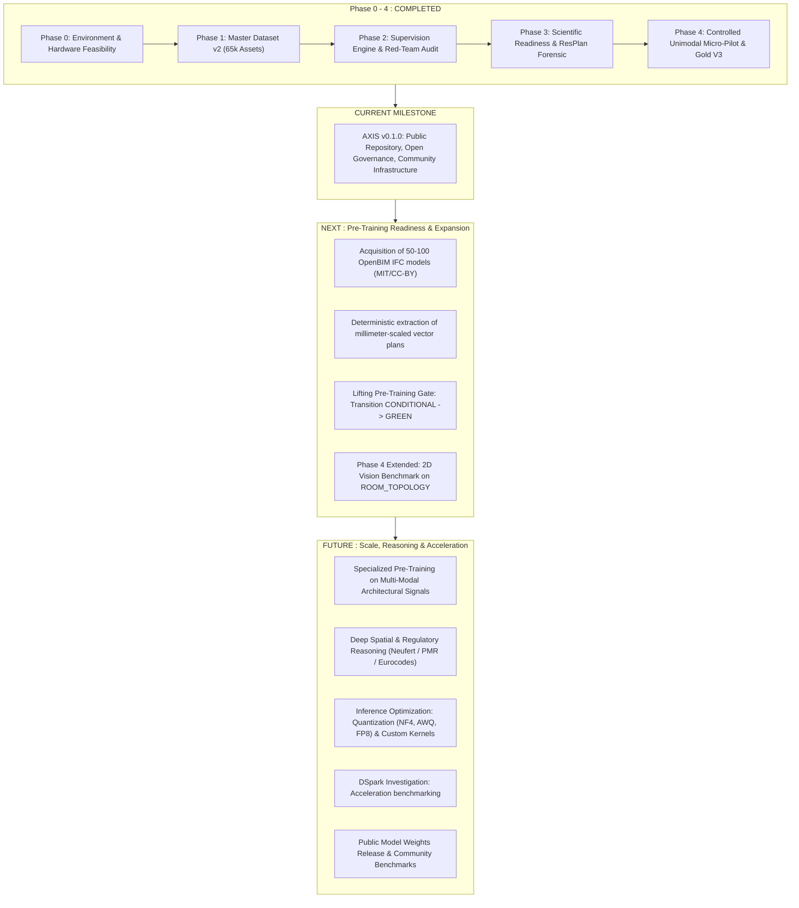

# AXIS — Scientific & Technical Roadmap

This roadmap details the progression of the **AXIS (Architectural eXpert Intelligence System)** research initiative. It distinguishes what has been empirically demonstrated, what is currently underway, and prospective milestones.

---

## Roadmap Phases

---

## Detailed Milestone Descriptions

### 1. COMPLETED
- [x] **Master Dataset v2 Closure:** Consolidated 65,342 unique assets across 19 sources with zero SHA256 and zero project leakage (`DATASET_SPLIT_REPORT.md`).
- [x] **Red-Team Quality & Harm Audit:** Identified and quarantined 41 harmful instances (pixel-as-m² confusion, fake multimodal dependencies).
- [x] **RAW Corpus Forensic Discovery:** Exhaustive scan of 66,847 files proving exactly 10 genuine 2D/3D pairs exist in RAW (`CORE_RESBIM_PAIRED`).
- [x] **ResPlan Metric Quarantine:** Quarantined 17,000 vector plans from metric calculation tasks due to arbitrary scale normalization; identified 6 safe scale-invariant topological capabilities.
- [x] **FloorPlanCAD Legal Quarantine:** Quarantined 741 vector drawings under `LEGAL_REVIEW_REQUIRED`.
- [x] **Phase 4 Task Gating:** Narrowed catalog to 4 strictly falsifiable tasks; excluded 65 tasks lacking deterministic grounding.
- [x] **Dataset A Construction:** Generated Small (800), Medium (2,400), and Full (6,000) subsets.
- [x] **Gold Set V3 Benchmark:** Sanctified 200 read-only instances + 200 adversarial hard negatives.
- [x] **Checkpoint `ARCHI-AI-P4-005` Validation:** Validated spatial clearance regression with **0.0517 m Gold MAE** vs Baseline 0 (**2.7739 m**), representing a **+98.14% relative improvement** and 100% normative accuracy.
- [x] **Micro-Experiment PoC:** Verified 4-bit NF4 QLoRA execution on Qwen2-VL-7B-Instruct (6 steps, 2 epochs, 0 OOM, 0 NaN).

---

### 2. CURRENT
- [x] **Official Nomenclature Migration:** Formal transition from `ARCHI-AI` codename to `AXIS` while preserving unbroken scientific provenance.
- [ ] **Public Community Launch:** Presenting AXIS to AI research communities (including Renaud Dékode, OpenBIM practitioners, CAD researchers) to onboard contributors.
- [ ] **Open Governance & Working Groups:** Establishing working tracks for ML researchers, BIM engineers, and architects.

---

### 3. NEXT
- [ ] **Corpus Gap Remediation (P0):** Acquire 50 to 100 permissive OpenBIM IFC models (MIT, Apache 2.0, CC-BY) with paired architectural elevations and floorplans.
- [ ] **Deterministic CAD Plan Derivation (P1):** Build an automated pipeline extracting millimeter-accurate vector plans from `IfcSpace` / `IfcWall` geometries, permanently solving the metric scale issue without relying on uncalibrated pixels.
- [ ] **2D Vision Benchmark Execution:** Train and evaluate a dedicated 2D vision backbone on `ROOM_TOPOLOGY` and `FLOORPLAN_READING` tasks from Dataset A.
- [ ] **Pre-Training Gate Unlocking:** Resolve the conditionality requirements defined in `SCIENTIFIC_READINESS_REPORT.md` to transition the gate from `RED/CONDITIONAL` to `GREEN`.

---

### 4. FUTURE
- [ ] **Specialized Pre-Training:** Large-scale unimodal and multimodal pre-training over certified architectural representations.
- [ ] **Normative & Regulatory Engine:** Deep reasoning across building codes (French accessibility / ERP, Neufert standards, IBC).
- [ ] **Inference Optimization:**
  - Quantization studies (NF4, AWQ, FP8 for sub-10 GB local workstations).
  - Custom geometric distance kernels (Triton/CUDA).
- [ ] **DSpark Acceleration Track:** Prospective investigation into DSpark for inference optimization and execution acceleration (pending physical benchmarks; no claims until verified).
- [ ] **Public Model Checkpoints & Comprehensive Benchmark Suite:** Open release of trained weights with standardized architectural evaluation harness.
