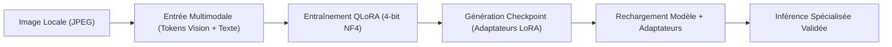

# ARCHI-AI - Note de Cadrage : Dataset Expérimental & Objectifs de Test

Date : 21 Septembre 2026  
Projet : **ARCHI-AI**  
Statut : **Mini-dataset technique préparé et validé**

---

## 1. Raison d'Être du Mini-Dataset

Dans un projet d'intelligence artificielle multimodale (Vision-Language Models), la mise en place directe d'un entraînement sur un corpus volumineux (plusieurs milliers ou dizaines de milliers d'exemples) constitue une démarche à haut risque technique et financier si le pipeline d'entraînement n'a pas été préalablement éprouvé dans ses moindres rouages.

Ce mini-dataset expérimental de **25 exemples** a été créé dans un but exclusif : **la validation technique de bout en bout de la chaîne logicielle et matérielle**.

---

## 2. Ce que ce Dataset Permet de Tester Concrètement

La chaîne complète que ce jeu de données permet de dérisquer comprend 6 étapes critiques :

### 1. Ingestion et Encodage Multimodal (`Image -> Donnée Multimodale`)
- Validation du pipeline de tokenisation conjointe via `AutoProcessor` / `Qwen2VLProcessor`.
- Vérification du bon découpage des images en patchs visuels sans dépassement de la fenêtre de contexte maximale.
- Contrôle de la résolution d'image (plafonnée à 1024x768) pour éviter l'explosion du nombre de tokens visuels.

### 2. Compatibilité Mémoire QLoRA (`Donnée -> QLoRA 4-bit`)
- Comme établi dans le rapport de faisabilité [`TRAINING_FEASIBILITY.md`](file:///c:/Users/encor/Documents/Devs/AEON-RWKV/ARCHI_AI/TRAINING_FEASIBILITY.md), l'inférence seule consomme déjà 7.54 Go sur les 8.0 Go de la RTX 4060 Ti.
- Ce mini-dataset permettra de vérifier sur 1 à 2 époques de test :
  - L'efficacité du *Gradient Checkpointing*.
  - L'absence de crash CUDA Out-Of-Memory (OOM) lors des passes backward de calcul de gradients.
  - La stabilité de l'optimiseur 8-bit `paged_adamw_8bit`.

### 3. Sauvegarde et Format des Checkpoints (`QLoRA -> Checkpoint`)
- Vérification que seuls les adaptateurs PEFT (`adapter_model.safetensors` et `adapter_config.json`, pesant quelques dizaines de mégaoctets) sont sauvegardés sans dupliquer les 14 Go du modèle de base.

### 4. Rechargement et Fusion des Poids (`Checkpoint -> Rechargement`)
- Test du chargement à chaud des adaptateurs LoRA sur le modèle quantifié en 4-bit.
- Vérification de l'intégrité des matrices LoRA sans perte de précision arithmétique.

### 5. Inférence Spécialisée & Format de Sortie (`Rechargement -> Inférence`)
- Vérification de la transition stylistique : passer de réponses génériques à une réponse structurée en 5 étapes (*Observation, Analyse, Points Forts, Points de Vigilance, Recommandation*).
- Vérification de la discipline anti-hallucination sur les dimensions physiques.

---

## 3. Périmètre et Non-Objectifs Stricts

Pour préserver la sécurité de l'infrastructure et éviter tout gaspillage de ressources :

| Action | Statut | Justification |
| :--- | :---: | :--- |
| **Téléchargement de gros datasets publics** | **Interdit** | Inutile à ce stade de prototypage ; saturerait le stockage et allongerait le cycle de test. |
| **Lancement d'un entraînement complet** | **Différé** | L'entraînement fera l'objet d'une phase dédiée avec protocole de surveillance mémoire pas à pas. |
| **Location de GPU cloud** | **Exclue** | La machine locale (RTX 4060 Ti 8 Go) suffit pour valider la compilation et l'exécution du pipeline. |
| **Modification de l'environnement Python** | **Verrouillée** | L'environnement virtuel existant dans `ARCHI_AI/.venv` est préservé sans altération. |
| **Altération du projet AEON-RWKV** | **Interdite** | Aucune interférence avec le cœur du dépôt hôte. |

---

## 4. Bilan de Préparation

Le dataset est dès à présent :
1. **Complet** : 25 exemples rédigés avec une haute exigence architecturale.
2. **Matérialisé localement** : 25 images téléchargées et optimisées dans `ARCHI_AI/dataset/images/`.
3. **Validé automatiquement** : Script `ARCHI_AI/validate_dataset.py` exécuté avec succès (100% conforme, 0 anomalie, 0 doublon).
4. **Prêt pour le pipeline QLoRA** : Formats `train.jsonl` et `validation.jsonl` directement compatibles avec les loaders Qwen2-VL.
