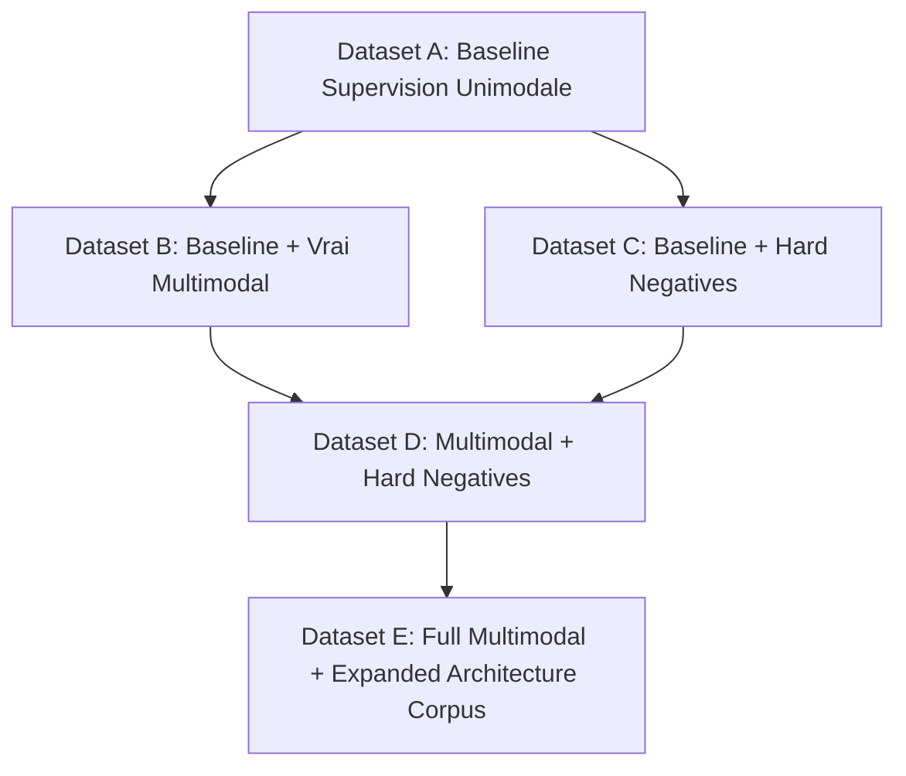

# ARCHI-AI — Plan d'Ablation Expérimentale & Design de Datasets (`ABLATION_DATASET_PLAN.md`)

> **Phase :** PHASE 3 — Corpus Expansion & Scientific Readiness  
> **Auteur :** Experimental Design Engineer & Lead Dataset Engineer  
> **Date :** 2026-09-21  
> **Objectif :** Définir les jeux de données expérimentaux étanches permettant d'isoler l'impact scientifique de chaque composante (multimodal, négatifs difficiles, extensions) sans modification incontrôlée.  
> **Règle d'Arrêt :** Aucun entraînement n'est lancé. Seuls les protocoles et manifests de partitions sont formalisés.  

---

## 1. Architecture du Design Expérimental Factoriel

Pour évaluer rigoureusement la contribution respective de chaque composante de données, ARCHI-AI définit 5 variantes de datasets de supervision. Chaque variante est construite par composition incrémentale sur une base commune certifiée :



---

## 2. Définition Détaillée des Jeux d'Ablation

| Variante | Nom du Jeu de Données | Effectif | Composition & Modalités | Hypothèse Scientifique Testée |
| :--- | :--- | :---: | :--- | :--- |
| **`DATASET_A`** | **Baseline Unimodale Pure** | 398 ex. | Tâches unimodales validées : Plan seul (`FLOORPLAN_READING`, `ROOM_TOPOLOGY`), Image seule (`IMAGE_ANALYSIS`, `MATERIAL`), 3D seule (`OBJECT_RELATION`, `CLEARANCE`), IFC seul (`IFC_ENTITY_IDENTIFICATION`, `IFC_QA`). Zéro multimodal direct, zéro hard negative. | Établit la performance socle du modèle en perception et raisonnement architectural compartimenté. |
| **`DATASET_B`** | **Baseline + Vrai Multimodal** | 408 ex. | `DATASET_A` + 10 exemples certifiés `BIM_PLUS_PLAN` (paires 2D/3D réelles). | Mesure l'effet du couplage 2D/3D sur la cohérence cross-modale et le transfert plan $\leftrightarrow$ maquette. |
| **`DATASET_C`** | **Baseline + Hard Negatives** | 598 ex. | `DATASET_A` + 200 contre-exemples architecturaux piégés (inversions de pièces, violations de dégagements, fausses cotations). | Mesure la résistance du modèle aux hallucinations et sa sensibilité aux défauts constructifs subtils. |
| **`DATASET_D`** | **Baseline + Multimodal + Hard Negatives** | 608 ex. | `DATASET_A` + 10 `BIM_PLUS_PLAN` + 200 Hard Negatives (actuel SUPERVISION V1). | Évalue la synergie entre robustesse contradictoire et raisonnement cross-modal. |
| **`DATASET_E`** | **Corpus Étendu (Futur Post-Acquisition)** | ~1 200 ex. | `DATASET_D` + 50 à 100 nouvelles paires 2D/3D (P0) + Plans vectoriels cotés décalibrés (P1). | Évalue le passage à l'échelle sur une diversité typologique complète (tertiaire, ERP, résidentiel varié). |

---

## 3. Matrice de Mesure de la Diversité

Conformément à la Section 23 du mandat, la diversité des données ne se mesure pas au simple nombre de fichiers, mais selon 10 axes orthogonaux :

| Axe de Diversité | Indicateur Mesuré | Couverture Actuelle (`DATASET_D`) | Cible Recommandée (`DATASET_E`) |
| :--- | :--- | :---: | :---: |
| **Source** | Nombre de dépôts physiques distincts | 7 sources actives | $\ge 12$ sources |
| **Project Group** | Groupes de projets étanches (`project_group_id`) | 56 groupes étanches | $\ge 150$ groupes |
| **Building Type** | Typologies de bâtiment (logement, bureau, santé, ERP) | 85 % logement, 15 % tertiaire/santé | 50 % logement, 30 % tertiaire, 20 % ERP |
| **Room Type** | Catégories d'espaces représentées | 12 catégories | $\ge 25$ catégories normalisées |
| **Modality** | Répartition des formats de représentation | 5 modalités physiques | 7 modalités complètes |
| **Task** | Tâches de supervision actives | 12 tâches actives (sur 43 validées) | $\ge 35$ tâches actives |
| **Difficulty** | Échelons de complexité cognitive | L1 (15%), L2 (30%), L3 (35%), L4 (15%), L5 (5%) | L1-L2 (30%), L3-L4 (50%), L5-L6 (20%) |
| **Geometry** | Forme et complexité des polygones | 43 % rectangulaires, 57 % non convexes | $\ge 65$ % plans complexes non orthogonaux |
| **Style / Contexte** | Contexte géographique et normatif | Principalement France (normes) + International | Élargissement normatif européen (Eurocodes) |
| **Scale** | Gamme d'échelle dimensionnelle | Studio (20 m²) à Immeuble R+3 (1 200 m²) | Studio à Complexe hospitalier multi-étages |

---

## 4. Protocole d'Expérience Pilote Contrôlée

Avant d'envisager tout entraînement ou toute acquisition massive, le protocole expérimental impose un pilote contrôlé à petite échelle :

```text
==================================================
PROTOCOLE DU MICRO-PILOTE CONTRÔLÉ (10 À 20 UNITÉS)
==================================================
1. Sélection de 10 à 20 nouvelles maquettes IFC avec plans associés conformes P0.
2. Intégration dans un split d'extension étanche 'dataset/supervision/pilot_v1/'.
3. Génération supervisée déterministe avec Grounding strict et Test d'Ablation.
4. Évaluation sur GOLD SET V3 (200 cas de référence immuables) + GOLD_V3_EXTENSION.
5. Audit adversarial Red Team (12 vecteurs de vulnérabilité).
6. DÉCISION DE PASSAGE À L'ÉCHELLE :
   - Si gain significatif mesuré sur le Gold Set sans régression unimodale : AUTORISER LE PASSAGE À L'ÉCHELLE.
   - Si stagnation ou régression : INTERDICTION FORMELLE DE SCALER.
==================================================
```
